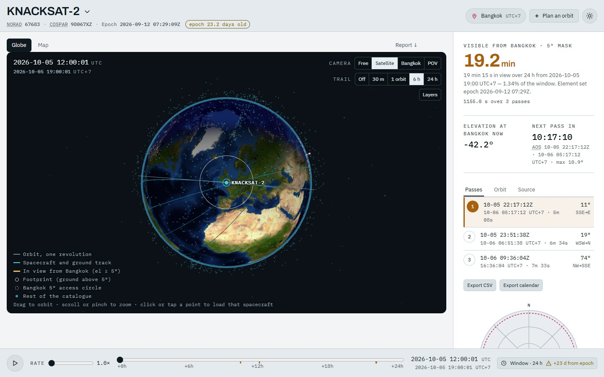
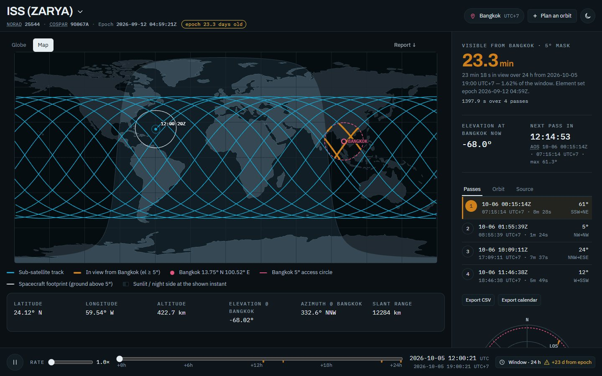
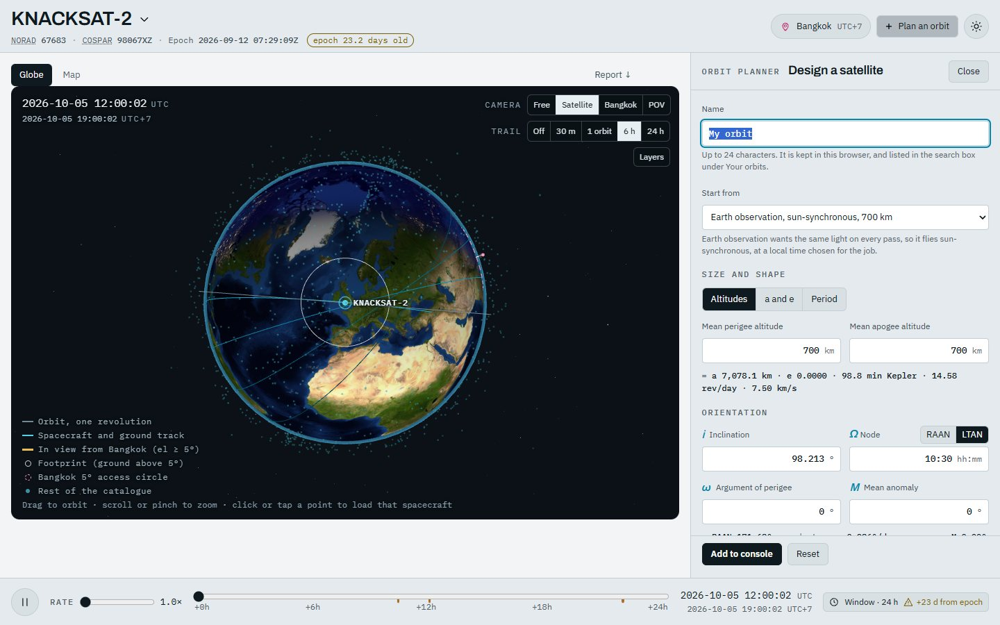
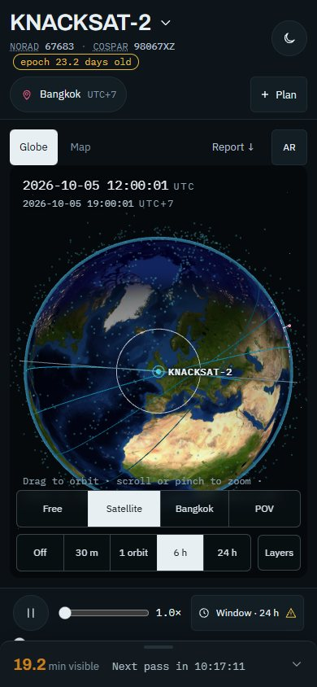

<div align="center">

# Ground Track Console

**Pick a satellite. See where it is, where it goes, and when it is above your horizon.**

[**Open the console →**](https://sattrackslop.vercel.app)
&nbsp;·&nbsp; [Lunar track console](https://sattrackslop.vercel.app/moon-track.html) *(testing)*
&nbsp;·&nbsp; [Earth–Moon system](https://sattrackslop.vercel.app/moon.html) *(testing)*



</div>

It started as a coursework assignment: read a Two-Line Element set, report the orbit's elements, plot a day of ground track, and total the time the satellite is above 5° elevation from Bangkok. It grew into a small satellite console. Everything is computed in your browser; there is no account, no analytics or cookies of its own, and nothing to install.

## What you can do

- **Search 2,158 spacecraft** by name or NORAD number and see the answer straight away: how many minutes it is above 5° from your place in the next 24 hours, when the next pass starts, and the passes one by one, the selected one with its sky plot.
- **Watch it move.** A 3D globe and a flat map, a clock you can run up to 3,600× or scrub, trails, the footprint on the ground, and a camera that can ride on the satellite or look from your site.
- **Set your own place.** Bangkok is the default; search for a town, use your location, or type coordinates. Times are shown in UTC and in the observer's local time (exact for a town or your device's location; for typed coordinates, the nearest hour of solar time unless you enter an offset).
- **Take it with you.** Download the passes as a spreadsheet (CSV) or add them to your calendar; the address carries the spacecraft, the window length, the place and the tab, so a link opens what you were looking at.
- **Design your own orbit.** *Plan an orbit* lets you type altitude, inclination and the rest, and *the Professor* explains in plain words what that orbit does (sun-synchronous or not, how long it survives, when it sees the Sun). Your orbits stay in your browser.
- **Ask when it will come down.** Where an object's history of element sets supports it, the page estimates the remaining life; for boosted, station-kept or too-little-history objects it refuses, and says why.
- **See it through your phone.** On a phone or tablet (over https), the AR view draws the sky, with the satellite in it, over the camera picture. The picture never leaves the phone.
- **Radio and eyes.** Doppler shift for the satellites that have a published downlink, and a naked-eye verdict for each pass.

<p align="center">
  
  
</p>
<p align="center">
  
</p>

## Try it

Links open the console already set up:

| Link | Shows |
|---|---|
| [`/?sat=25544`](https://sattrackslop.vercel.app/?sat=25544) | the ISS |
| [`/?sat=25544&span=72&tab=map`](https://sattrackslop.vercel.app/?sat=25544&span=72&tab=map) | the ISS, a three-day window, on the flat map |
| [`/?site=35.6762,139.6503`](https://sattrackslop.vercel.app/?site=35.6762,139.6503) | passes seen from Tokyo |
| [`/?tle=embedded`](https://sattrackslop.vercel.app/?tle=embedded) | the *assignment snapshot*: the element sets that ship with the page, each window opening at its set's epoch, and no element-set requests at all (the planner is switched off) |

Keys: <kbd>Space</kbd> play/pause · <kbd>←</kbd> <kbd>→</kbd> a minute back/forward (with <kbd>Shift</kbd>, an hour) · <kbd>[</kbd> <kbd>]</kbd> slower/faster · <kbd>g</kbd> globe · <kbd>m</kbd> map · <kbd>/</kbd> search for a spacecraft.

## Run it yourself

You need Node 22.12 or newer. (Node 20.19 can build and preview the page, but `npm run dev` and the tests need 22.12.)

```bash
npm ci
npm run dev        # the console on http://127.0.0.1:5173, with the optional cache API beside it
npm run build      # the production build, into dist/
npm run preview    # dist/ on http://127.0.0.1:4173
```

The built page is static files: any web server will do. The cache API in `server/` (a small [Elysia](https://elysiajs.com) service that remembers element sets for a few hours) is optional; without it the page asks [CelesTrak](https://celestrak.org) itself, as it always did.

## How it works, in a paragraph

The page takes a satellite's Two-Line Element set, works out its orbit, and runs the **SGP4** model (the one the published element sets are made for) to place it every few seconds over the window you choose. From the satellite's position and yours it computes elevation and azimuth, finds the stretches above the 5° mask, and totals them. The globe is [three.js](https://threejs.org); the SGP4 is [satellite.js](https://github.com/shashwatak/satellite-js); the page is [Svelte 5](https://svelte.dev) and TypeScript, built with [Vite](https://vite.dev).

## Can you trust the numbers?

This is a rebuild of the project's original single-file page, and the numbers did not change. A regression gate (`npm run gate`) rebuilds the production bundle and compares **67,488 computed values** (38 spacecraft, from Bangkok, over 24 and 72 hours) with a baseline taken from the original page, exactly, with `===`; it must print `BIT-IDENTICAL`. Around it sit 27 more stages of checks (`npm run test:all`): an independent second implementation of the orbit maths, comparisons of the 3D scene with the original (identical in all 16 test views), the planner and Professor, accessibility rules, and layout at twelve screen sizes. The checks drive a real browser, so run `npx playwright install chromium` once first. The old page is kept in git at the tag [`legacy-earth-console`](https://github.com/ColaBear101/SattrackSlop/tree/legacy-earth-console).

## Data and privacy

The console loads nothing from anyone else: its fonts, its maths library, the Blue Marble picture and the night-lights map are all files of the page itself. (The two Moon pages are older and still use cdnjs and Google Fonts, and the lunar one NASA Moon Trek.) CelesTrak and the other services below do see your IP address and what you ask them for.

| When | Who is asked | What for |
|---|---|---|
| a spacecraft is on screen (then every 3 hours) | the page's cache API if there is one, otherwise [CelesTrak](https://celestrak.org), with [tle.ivanstanojevic.me](https://tle.ivanstanojevic.me) as a fallback | its current element set (never for an orbit you designed, and never under `?tle=embedded`) |
| you ask for a remaining-life estimate | the cache API if there is one, otherwise CelesTrak | the object's history of element sets |
| you type a place name | [Open-Meteo](https://open-meteo.com) | finding its coordinates |
| you pick *Yesterday's clouds* | [NASA GIBS](https://nasa-gibs.github.io/gibs-api-docs/) | yesterday's satellite picture |

The camera, motion sensors and your location are used only when you tap the button that needs them, and they are never sent anywhere.

## Where things are

| | |
|---|---|
| `src/` | the console: `lib/` the maths and the sentences, `state/` the stores, `components/` the screens, `scene/` the 3D globe |
| `server/`, `shared/` | the optional cache API |
| `data/` | the catalogue, the coastlines, the radio table, the magnetic model |
| `public/` | the two Moon pages, as they always were |
| `verification/`, `tests/` | the checks |
| [`CHANGES-FROM-LEGACY.md`](CHANGES-FROM-LEGACY.md) | every difference from the original page, with its reason |
| [`CLAUDE.md`](CLAUDE.md) | the working rules for anyone changing the code |

## The full technical README

The long account of the project (the orbit maths worked through for the assignment, the decay model, the planner and the Professor, the AR view, the Moon pages, how every check works) is below, folded away. It was written with AI assistance.

<details>
<summary><b>Open the full technical README</b> <i>(about 2,700 lines)</i></summary>

### Ground Track Console

Read a Two-Line Element set, report the Keplerian elements, propagate and plot a day of ground
track, and total the time a spacecraft is visible from Bangkok above a 5° elevation mask.

That was the assignment. The program outgrew it: the same engine now runs a Moon-centred console
and an Earth–Moon libration-point view, because the central body turned out to be the only thing
that was ever really Earth-specific.

| | |
|---|---|
| **Ground track console** | https://sattrackslop.vercel.app |
| **Lunar track console** *(testing)* | https://sattrackslop.vercel.app/moon-track.html |
| **Earth–Moon system** *(testing)* | https://sattrackslop.vercel.app/moon.html |

The Earth console is a Svelte 5 and TypeScript app built with Vite 8, so, unlike the page it
replaced, it has a build step and cannot be opened from disk: ES modules and the data files it
fetches need an origin. `npm ci`, then `npm run dev` (Vite on port 5173, with the cache API on
3001 beside it), or `npm run build` and `npm run preview` (port 4173); **Running it** has the
rest. It needs no server of its own, though: `dist/` is static files, and the cache API in
`server/` is optional. Every difference from the old page is listed, with its reason, in
`CHANGES-FROM-LEGACY.md`. The Moon pages are the plain scripts they always were, in `public/`,
copied to `dist/` as they are, and they still open from disk. The satellite catalogue, the
coastlines, the Blue Marble imagery and the city lights, and the lunar ephemerides ship with the
pages. What they fetch, and what happens without it:

- **On load, from cdnjs, on the Moon pages only:** `three.js` r128 for their 3D views, which fall
  back to the flat map or the tables without it. They pin it by a Subresource Integrity hash as
  well as by version, so a changed file is refused rather than run. The Earth page loads no script
  from anyone else: `satellite.js` 6.0.1, the SGP4 it cannot work without, and `three.js` r128 are
  bundled from npm at exactly those versions, and the lockfile pins their tarballs by hash.
- **On load, optional:** on the Moon pages, the webfonts from Google Fonts (system fonts
  otherwise); the Earth page's fonts are files of its own. On the Earth page, the current element
  set for the spacecraft on screen (never for an orbit you designed yourself), from the page's own
  cache API, `/api/tle/<n>`, if one answers as itself (see **Staying current**), and otherwise
  from CelesTrak's `gp.php` with `tle.ivanstanojevic.me` as the fallback, asked for when a
  spacecraft is put on screen and every three hours while it stays there; an answer is reused for
  three hours and a failure retried after five minutes (the embedded snapshot otherwise; never
  under `?tle=embedded`, which asks no one for an element set, the page's own API included). On
  the lunar track page, the LRO surface mosaic from NASA Moon Trek (a surface painted from the
  feature list otherwise). The Earth–Moon page fetches nothing past the fonts and `three.js`.
- **Only when asked:** an object's element-set history for the decay forecast, from the page's own
  cache API, `/api/history/<n>`, if one answers as itself (see **Staying current**), and
  otherwise from CelesTrak's `graph-orbit-data.php`; a place-name search from Open-Meteo's
  geocoder; and yesterday's VIIRS true colour from NASA GIBS, if *Yesterday's clouds* is picked
  (the drawn coastlines otherwise). The default globe asks nobody for anything: the Blue Marble
  and the city lights (`citylights-2048.jpg`, the VIIRS 2012 night-lights mosaic, saved once from
  GIBS on 2026-10-08) ship with the page. On a phone or tablet, the AR view asks the device, not a
  server, for its rear camera, its motion sensors and — if *Use my location* is pressed — its
  position. The picture is drawn over on the phone and goes nowhere, and the sensor readings are
  neither kept nor sent; a position taken with *Use my location* becomes the observer, saved in
  this browser the way the console's own *Use my location* saves it.

#### What's here

Three pages over one shared core, which now exists in two forms: the classic scripts in
`public/core/`, which the lunar track page loads, and the Earth half of them ported to TypeScript
in `src/lib/core/`, which the Earth console is built from. A permanent test
(`tests/lib/core-equivalence.test.ts`) holds the two bit for bit equal. The layout says which is
which:

```
index.html          Earth ground track, elements, Bangkok visibility, decay forecast,
                    and orbits you design yourself. Vite's entry: it takes a build, and
                    does not open from disk
public/moon-track.html
                    Moon-centred: lunar orbiters and landing sites
public/moon.html    Earth–Moon system and the five libration points

src/                the Earth console's source: Svelte 5 + TypeScript
  main.ts             mounts App.svelte; the test surface (testing/surface.ts, which the
                      suites drive as window.__gt) is a lazy chunk, fetched only when
                      window.__GT_TEST__ is set
  styles/             the tokens (colour, type, space; light and dark), the base, the fonts
  lib/                plain TypeScript, no framework and no page state
    core/               the body-agnostic half: the Earth's, ported from public/core/
      body.ts             what is a property of the CENTRAL BODY — rotation,
                          sub-satellite point, look angles, radii, mu
      propagator.ts       what is a property of HOW A THING MOVES — SGP4 for Earth TLEs
      sun.ts              where the Sun is, and where it is overhead (from the old
                          page's inline script, not from public/core/)
    analysis/           elements, ground track, passes, the optics, the Doppler shift
    catalogue/          reading the catalogue; ranking what the picker offers
    text/               the sentences the page builds from its numbers, and the glossary, as data
    net/                the element sets (the page's own cache API first, then CelesTrak and its
                        mirror, as the old page asked them) and the decay histories (the API,
                        then CelesTrak)
    export/             the CSV and the calendar
    data/               the downlink table's lookups (the table is data/transmitters.json)
    shims/              the entries scripts/build-shims.mjs bundles for the Node suites
    planner/            the planner, the Professor and the decay model, moved from the old page's
                        files with their arithmetic untouched
      planner.ts          your own orbits, the maths: typed mean elements to a Two-Line
                          Element set, validation, the matched B*, the eleven presets
      advisor.ts          the Professor's numbers: the kernels, the lifetime model and
                          the dictionary of figures worked out for an orbit
      advisor-copy.ts     the Professor's words: 87 items, each one condition and one text
      lifetime.ts         orbital decay and re-entry forecasting
      custom.ts           the reader's own orbits, from the old page's inline script, as
                          pure functions
    ar/
      wmm.ts              the World Magnetic Model 2025: how far a compass's north is
                          from true north, at the observer
      skyar.ts            the AR view's maths: the phone's orientation as a camera,
                          the projection, the iPhone's compass
      arview.ts           the AR view: the motion sensors, the rear camera, and the
                          sky drawn over the picture
    places.ts           finding the observer: place search, this device, timezones
    observer.ts         where the observer is, and how that is remembered
    gt.ts               the DOM-free half of the test surface, which the gate measures
  state/              the stores (Svelte runes): app, clock, custom, live, life, prefs,
                      report, doppler, wall; url.ts, shortcuts.ts, storage.ts; and the
                      one engine, the network's wiring and the planner's modules
  components/         the page's parts
    shell/              the app bar, the spacecraft picker, the observer chip, the theme toggle
    stage/              the globe and its controls, and the flat map
    rail/               the answer rail: the passes, the orbit, the element set's source
    transport/          the clock and the window
    report/             the written report: elements, ground track, passes, decay, method,
                        terms, and the Professor's notes
    planner/            the planner and the Professor
      plannerui.ts        the planner's form, the Professor's panel, the saved list, and
                          the Professor's section on the spacecraft on screen (the old
                          controller, ported; its markup is the .svelte files beside it)
    ar/                 the AR view, and the page's side of it
    ui/                 the primitives: buttons, popovers, tabs, icons
  scene/              the 3D globe (three r128, imperative, not Svelte)
    orbit3d.ts          the WebGL globe
    orbitviz.ts         orbital-element vectors, stars, constellations, planets
    globetex.ts         NASA imagery for the globe's surface: the Blue Marble and the night
                        lights from src/assets/globe/, the dated layers from GIBS
  assets/globe/       the Blue Marble (2048, 4096 and 8192 px) and the city lights

public/             what the build copies to dist/ as it is: the Moon pages above, the
                    scripts they load, and favicon.svg
  core/               the body-agnostic half, whole: the Earth's and the Moon's
    body.js             the central body, Earth and Moon (the Earth's half is body.ts)
    propagator.js       SGP4 for Earth TLEs, Kepler and daily-anchored for everything else
  moon/
    lunar.js            ELP-2000 lunar ephemeris + CR3BP libration points
    moonviz.js          the Earth–Moon 3D scene
    moondata.js         baked lunar orbiter ephemerides, landing sites, features
    moon3d.js           the lunar track console's 3D scene

server/, shared/    the cache API (Elysia): GET /api/health, /api/tle/:norad and
                    /api/history/:norad; and the code the browser and the server share
serve.ts            runs the API on a port (3001 unless PORT says otherwise)
data/               catalogue.txt (+ .meta.json): the 2,158 element sets; world.json: the
                    coastlines; transmitters.json: downlink frequencies; WMM.COF: NOAA's
                    magnetic model

scripts/            extract-data (the data files, from what the old page carried inline),
                    build-shims (esbuild bundles of the library for the Node suites),
                    check-deps (the layer rule), csp (the page's inline script against the
                    hash in vercel.json), legacy-manifest (pins the old page's files),
                    compare-planner-markup (the planner's markup against the old page's)
tests/              Vitest, a folder to a layer: lib, state, components, scene, net, shared,
                    server; and data, build (what the bundle holds) and moon (the Moon
                    pages are unchanged)
verification/       an independent second implementation, and the regression gate
                    (regress.js against baseline.json). Also the browser suites, which
                    serve the build over http through lib/harness.js; run.js, which runs
                    every stage and prints one table; and, made from the old page, what the
                    rebuilt one is held to: golden.json (its prose) and ab3d/ (its 3D scene)

vercel.json         frontend-only: the build, immutable /assets, nosniff, no-referrer, a
                    Permissions-Policy, and a report-only CSP that names the page's one
                    inline script by hash

legacy/             deleted at the cutover. The old page lives in git at the tag
                    `legacy-earth-console` (main@4eadd7a). To run a suite against it:
                    `git worktree add legacy legacy-earth-console`, then
                    `GT_TARGET=legacy node verification/<suite>.js`. Three of the scripts
                    above (extract-data, legacy-manifest, compare-planner-markup) read it too.
```

The dependency graph is one-way, and `npm run check:deps` holds it: the components import the
stores, the stores import `lib/`, `lib/` imports only `shared/` (the one thing it takes from
`server/` is a type), the scene imports `lib/`, and the server imports `shared/` only. Pages
depend on `core/`, `core/` depends on nothing. No file in `src/` is loaded by the Moon pages, and
no file in `public/moon/` is loaded by the Earth page.

##### Status

The Earth console is the finished piece: it answers the assignment and is held to a
bit-identical regression gate on every change.

**Both Moon pages are marked *testing* in their own mastheads**, and the badge names the actual
reasons rather than hedging. They are not covered by that gate; the lunar ephemerides are baked
at build time and frozen, because Horizons sends no CORS header and a browser cannot re-fetch
them; positions agree with Horizons to about a kilometre and a half near a daily anchor and tens
of kilometres between them, and Horizons is itself predicting past each record's last tracking
data; and two of the five spacecraft have no published ephemeris at all. Each page computes and
shows its own staleness — how long ago the data was baked, and which craft runs out of coverage
first — so the warning cannot quietly go out of date.

#### The assignment

Select a satellite from CelesTrak's Earth Resources group and build a web program that reports its
orbital elements, plots a day of ground track, and totals its visibility from Bangkok above a 5°
mask. Parts (a), (b) and (c) below work it for KNACKSAT-2, which is **not** in that group — see
**Satellite**.

#### Satellite

**KNACKSAT-2** — NORAD 67683, international designator 1998-067XZ — a Thai CubeSat. That
designator is the giveaway: `1998-067` is the ISS, so KNACKSAT-2 was deployed from the station
and shares its 51.63° orbit at roughly 360 km, not a sun-synchronous one.

**KNACKSAT-2 is outside the brief.** It is not in CelesTrak's Earth Resources group:
`verification/resource.txt`, a copy of that group's 167 element sets, has no entry for it, and it
came into this catalogue from SatNOGS rather than from a CelesTrak group (see **Data
provenance**). The figures in (a) to (c) are correct for KNACKSAT-2, but they are not an answer
from the group the brief names. KNACKSAT-2 stays the page's default. The page no longer says so
over the answer (the old one did, in a note headed "Outside the brief"); this is where it is said,
and the glossary's entry "Earth Resources group, the brief" says it again.

```
KNACKSAT-2
1 67683U 98067XZ  26255.31192122  .00056149  00000-0  48789-3 0  9995
2 67683  51.6258 213.5681 0007959 152.6345 207.5073 15.68476422 33916
```

Epoch: **2026-09-12 07:29:09.993 UTC** (day 255.31192122 of 2026).

Every figure quoted in this README is computed from *that* element set, with the window opening
at its epoch, so the numbers stay checkable. The live page does neither: it fetches a newer set on
load (see **Staying current** below) and opens the window at the reader's clock, so what it shows
will differ — and should. The line under the headline total says which window and which set it
used, so two readers an hour apart can see why their numbers disagree.

To reproduce the README on the page, open it with `?tle=embedded` — the **assignment snapshot**
link in the answer rail's *Source* tab, under the element set's two lines. That keeps the embedded
element sets, asks no source for a newer one, and opens each spacecraft's window at its own epoch.
The observer has to be Bangkok too: a site you moved to is remembered, so press *Reset to Bangkok*
in the observer's panel (the chip in the header) first if you did. KNACKSAT-2 then reads
899.7 s over 2 passes ("15 min 00 s in view over 24 h from 2026-09-12 14:29 UTC+7 … Element set
epoch 2026-09-12 07:29Z, embedded").
`verification/verify-refresh.js` checks it, with a newer set on offer that must not be asked for.

The picker is the page's title, at the top left: press the name and it opens a search over **2,158
spacecraft** by name or NORAD ID — type `knack`, `noaa`, `iss`, or `25544`. Everything on the page
recomputes on selection.

#### (a) Orbital elements at epoch

| Element | Symbol | Value | Where it comes from |
|---|---|---|---|
| Semi-major axis | a | **6741.908 km** | SGP4's Brouwer value, recovered from the Kozai mean motion |
| Eccentricity | e | **0.0007959** | line 2 cols 27–33 (leading decimal implied) |
| Inclination | i | **51.6258°** | line 2 cols 9–16 |
| RAAN | Ω | **213.5681°** | line 2 cols 18–25 |
| Argument of perigee | ω | **152.6345°** | line 2 cols 35–42 |
| Mean anomaly at epoch | M | **207.5073°** | line 2 cols 44–51 |

Five of the six are stored literally in the TLE. The semi-major axis is not, and getting it right
takes more than one line of algebra. All six are SGP4 *mean* elements — the theory's averaged orbit,
with its periodic terms taken out — and not the osculating elements of the instantaneous two-body
orbit — a distinction that turns out to matter more than the one below.

The obvious route is Kepler's third law applied to the TLE's mean motion:

```
n = 15.68476422 rev/day × 2π / 86400 = 1.140651e-3 rad/s
a = (μ / n²)^(1/3),  μ = 398600.4418 km³/s²   →   6741.396 km
```

**That is not the value SGP4 works with.** The mean motion in a TLE is a *Kozai* mean motion, and
SGP4's theory runs on Brouwer's mean elements. The two are different mean-element conventions, and
their mean motions differ by a term of order J2. SGP4 converts
the Kozai value to Brouwer's during initialisation and recovers the Brouwer semi-major axis from it,
and that is the value the page shows:

```
a = 6741.908 km            (SGP4's Brouwer mean value, on WGS-72 where the theory is defined)
naive form, against it:      −512 m
```

The difference depends on inclination through a (3cos²i − 1) term, so it nearly vanishes at 54.7° —
which is why KNACKSAT-2 at 51.63° is a best case — and is largest for equatorial and polar orbits.
Across the 2158-satellite catalogue the median difference is **2.95 km**, the largest **6.38 km**.

Neither number is the semi-major axis of the ellipse the spacecraft is on at the epoch. Convert
SGP4's own position and velocity there to two-body elements (on its μ = 398 600.8 km³/s²) and the
osculating orbit has a = 6747.93 km, e = 0.0012452 and ω = 83.03°, against the mean 6741.908 km,
0.0007959 and 152.63°; its a moves 12.1 km over one revolution. The page lists these under the mean
elements. At an eccentricity this small ω and M are each poorly defined, and only their sum, the
argument of latitude, means much: the epoch sits 0.14° past the ascending node in the mean elements
and 0.00° in the osculating ones. So the 512 m is a real correction — the naive form is a formula
SGP4 does not use — but it is small beside the 6 km between the mean and osculating a.

Derived: nodal period 91.75 min, measured node-to-node rather than as 86400/n, which runs 3.7 s
long. Altitude 358.0–383.8 km over one revolution, taken from the propagation rather than from
a(1∓e) − Rₑ. The mean-element form gives a swing of 2ae = 10.7 km and misses two things of the same
size. The orbit radius itself varies 19.5 km, because SGP4's periodic terms move it: 8.3 km of the
excess is J3's long-period eccentricity term and under 1 km is J2's short-period one. And altitude
is height above the WGS-84 ellipsoid, whose surface under the track is 13.2 km lower at ±51.8° than
at the equator. The two combine, by phase, into the swing above. On a highly eccentric object the
mean-element form also returns a perigee altitude *below the surface*.

These figures are for a window starting at the epoch. The page measures the period and the apsis
altitudes over the first revolution of whatever window is set — by default one starting now — so
its figures move a little with the window, and it says so under them.

For a near-equatorial object in deep space the node-to-node period is not a usable number. At
i = 0.03° the latitude being timed never exceeds a few hundredths of a degree, and the Moon and Sun
move it by as much. With the window at the regression baseline's start, 2026-09-13 00:00 UTC, GEO
objects in the catalogue below 0.3° measured anywhere from 1307 to 1543 min against a sidereal day
of 1436.07 (GOES 18: 1461.4); started at each object's own epoch, the low end is 724 min (ASTRA 2G),
about half a revolution. LEO orbits are unaffected even at 0.23°, because J2 is symmetric about
the equator; SGP4 applies lunisolar terms only past 225 min. For deep-space orbits below 1°, and
wherever no two nodes are found, the page shows the Keplerian 2π√(a³/μ) from SGP4's a instead and
labels it "Kepler period" — 1436.13 min for GOES 18. The apsis altitudes there are still sampled
over one node-to-node interval, because the regression baseline is built on it, so the page gives
that interval's length and the fraction of a revolution it covers instead of calling it one
revolution, and does not set a radius swing from half an orbit against 2ae.

Note also the drag term `ndot = .00056149` — three orders of magnitude larger than a sun-synchronous imager's. At
360 km the atmosphere is still biting, and this element set goes stale fast.

#### (b) Ground track

24 hours from the epoch, SGP4-propagated, sampled every 10 s (8641 points), drawn on an
equirectangular projection with Natural Earth 110 m coastlines. TEME → ECEF by Greenwich mean
sidereal time → geodetic sub-satellite point on WGS-84. The track breaks at the antimeridian.
Segments where Bangkok has the spacecraft above 5° are overdrawn thicker and in a second colour.
A time scrubber moves the spacecraft along the track and re-renders the day/night terminator.

At 51.63° inclination the track is a band between ±51.8° geodetic latitude — the orbit plane bounds
geocentric latitude at the inclination, and geodetic latitude runs about 0.2° higher up there.
Bangkok at 13.75°N sits well inside it, unlike a near-polar track that crosses the tropics
almost vertically.

The inclination card reads that reach off the drawn track and gives each reason it differs from i,
both measured on the same samples: geodetic against geocentric latitude, 0.18° here, and the actual
plane against the mean i, 0.02° here. At LEO the second is SGP4's periodic terms, which a mean
element averages out. In deep space there is more to it. The i in the element set is the mean
inclination *at the epoch*, and SGP4 moves the mean inclination itself at a steady rate under the
Moon's and Sun's pull, so a fortnight later the mean in force is a different number — and near the
equator that drift can be most of the inclination. In a 24 h window from 2026-09-27 00:00 UTC,
GOES 18's plane peaks at 0.008° against the element set's 0.035°. At that instant, 14.9 days after
the epoch, SGP4's own mean inclination is 0.007°, and the periodic terms put the plane 0.001°
above it. ASTRA 2G in the same window goes the other way: its mean has risen to 0.029°, and the
periodic terms hold the plane at 0.002°. At its epoch there is no drift yet, and its plane sits at
0.001° against a mean 0.024°. So the card works out the mean in force where the track peaks from
SGP4's own rate, and credits the periodic terms only with the rest: for MMS 1 over a week from the
same date, 0.9° of periodic terms on 0.1° of drift. The card reads the track only when the window
holds a whole revolution. MMS 1's period is 85 h, so a 24 h window holds about a quarter of one,
and the arc in it reached ±11.5° in the case that found this. For such a window the card gives the
plane's osculating tilt at the window start, about ±74° — a geocentric figure, as the plane's bound
is — and says how far the arc got, in geodetic latitude like the map.

#### (c) Visibility from Bangkok (13.75°N, 100.52°E, 5° mask)

**Total cumulative time in view: 899.7 s = 14.99 minutes** — 1.04 % of the day, over **2 passes**.

| # | Date | AOS (UTC) | LOS (UTC) | Duration | Max elevation | Min range |
|---|---|---|---|---|---|---|
| 1 | 2026-09-12 | 09:02:12 | 09:09:47 | 7m 36s | 45.1° | 505 km |
| 2 | 2026-09-12 | 18:48:18 | 18:55:42 | 7m 24s | 40.0° | 538 km |

Fewer passes than a polar satellite but much better ones: both climb above 40°. The low orbit is the reason for both — a 14.5° access footprint means the
spacecraft must pass close overhead to be seen at all, but when it does, it is only ~500 km away.

Elevation is scanned every 4 s and each crossing of the 5° mask is then bracketed and bisected to
1 ms, so the total is not quantised by the scan. The scan has to be finer than the shortest pass
worth reporting: bisection only refines a crossing it has already bracketed, so at a 10 s step a
6-second pass is not merely imprecise, it is invisible.

The page dates each pass in UTC, as the table above does, and a local time that falls on another
calendar day carries that day. It used to tag times with "+Nd" counted in whole 24 h periods from
the window start, which begins at whatever the clock said — so a pass at 03:07Z the next morning
had no tag, and "+1d" could mean two calendar days on. A pass already above the mask when the
window opens, or still above it when the window closes, is marked `*`: its AOS or LOS there is the
window edge, not a horizon crossing, and its duration counts only the part inside the window. A
geostationary spacecraft is the whole-window case, and the countdown says it is still up at the
window end rather than that it sets. After the window's last pass the countdown searches the 48 h
beyond the window for the real next pass. It used to count down to the window's first pass as if
the ground track repeated every window, which in the case that found it was 66.6 minutes late and
promised 74.2° for a 19.7° pass.

Geometry only — no refraction, terrain or link budget, and no daylight/eclipse condition (this is
radio visibility, not naked-eye). Refraction is the largest unmodelled term: at 5° it is about
9.9 arcminutes, which adds roughly **8.4 s (+0.93 %)** to the total and moves each horizon crossing
by about 2 s. Worth knowing when reading a figure quoted to 0.1 s.

#### How the Earth numbers are checked

An independent second implementation (own WGS-84 ECEF→ENU elevation, own TLE column parsing,
own Kepler-third-law semi-major axis, own Kozai-to-Brouwer conversion) was cross-checked against
this one:

- The five elements read straight from the TLE agree to better than 1e-12 relative. The
  semi-major axis, the period and the apsis altitudes are now taken from SGP4 rather than from
  mean-element algebra, for the reasons in section (a), so they deliberately differ from the
  harness's naive values.
- The semi-major axis the page does show is checked on its own. The harness re-derives SGP4's
  un-Kozai step from Spacetrack Report #3 on WGS-72 and compares it with the value
  `src/lib/core/propagator.ts` hands the page (the harness reaches it through the library bundle
  that `npm run build:shims` makes): they agree to 2.7e-16 relative across all 167 element sets
  in `verification/resource.txt`. Until that check existed, nothing independent looked at the
  number on the card — the naive-against-naive comparison above passed whatever SGP4 did.
- Topocentric elevation agrees with `satellite.js` look angles to 2.6e-10 degrees over 200
  samples across the day, and with a from-scratch WGS-84 topocentric implementation to 1.1e-9
  degrees over 24 h — floating-point noise, no systematic bias.
- The visibility total is stable to 10 milliarcseconds across scan steps of 10 s, 5 s, 1 s and
  0.25 s, and the culmination solver matches a 200 000-point brute force to 0 ms.
- A deliberately dumb brute-force check — 86 400 one-second samples, counting those above 5°:
  - KNACKSAT-2: **899 s in 2 runs** vs this program's **899.7 s in 2 passes**

  The gap is the expected quantisation of a 1 s counter against millisecond-precise AOS/LOS.
- Both sides run the same SGP4 bytes. The harness propagates with `verification/satellite.min.js`,
  the `satellite.js` 6.0.1 file the old page loaded from cdnjs under an integrity hash. The
  rebuilt page loads nothing from a CDN: it bundles `satellite.js` 6.0.1 from npm, and the harness
  requires `package.json` and `package-lock.json` to name exactly that version and the sha512 of
  its tarball recorded in `verification/verify.js` (check 5a; three.js r128, which the globe's
  palette is tuned to, is pinned the same way). `tests/lib/satellite-parity.test.ts` proves that
  the npm build and `verification/satellite.min.js` give the same bits, on every element set in the
  catalogue and a spread of instants. A bumped version or a swapped tarball fails the check, and a
  build that gave other bits would fail the parity test, so the second implementation cannot drift
  onto a different build from the page it is checking. The gate, which loads the built page, would
  already notice a build that moved the numbers; the pin also refuses one that leaves them alone
  and does something else. The Moon pages, which still load three.js r128 from cdnjs, are held to
  the hash of the bytes npm ships for it (check 5b).

Run it yourself, on the rebuilt page: `npm run build:shims` once, then
`GT_TARGET=new node verification/verify.js`.

#### The view from the spacecraft

The camera control has four positions — Free, Satellite, Bangkok, POV — but only two kinds of
camera. The first three are the *same* camera: a point at a fixed distance from the Earth's centre,
looking at the Earth's centre, differing only in how the bearing is chosen. "Satellite" therefore
shows the Earth from the spacecraft's **direction**, which is not the same thing as showing it from
the spacecraft. At 4.2 Earth radii out, the spacecraft is a dot in the middle of the frame.
*AR*, which a touch screen has in the stage's row of tabs and not among these, is not a fifth: it
leaves the globe for the phone's own camera (see **The sky through the phone**).

**POV** sits on the spacecraft, facing **along-track** by default: forward along the horizontal part
of the velocity, with the zenith as screen-up, so the horizon runs level across the frame. Nadir is
pitch −90°, one drag down. It used to open on nadir, the orientation nadir imagery is published in,
and that was given up for a mechanical reason: with the view axis on the local vertical, a sideways
drag — which yaws about that vertical — could only roll the picture, and the camera felt stuck.
Facing forward separates the two, so yaw turns the head and pitch tilts it. Dragging turns the head
instead of leaving the mode, and the wheel changes the **lens** rather than the range, because there
is no range to change from on board: 8° is a long telephoto on the limb, 90° takes in the whole
horizon.

From KNACKSAT-2 at 369.8 km the horizon sits **70.94° off nadir** — 19.06° below the local
horizontal — so the forward view opens with its centre above the limb: the Earth is a thin band along
the bottom of the 42° frame with the atmosphere's glow over it, and two degrees of pitch up take the
planet itself out of the picture. There is no ground at the centre of that view to measure, so the
GSD readout gives the figure straight down instead and says where that is: **at nadir, below frame**.
The second half is dropped when nadir is in the picture, which from GEO it can be with the boresight
already off the disc — the whole Earth is 17° across from there. The catalogue cloud is still drawn,
which means the other 2,157 objects are visible from orbit as points above the limb — that falls out
of the existing scene rather than being built.

Four things were not obvious until the view existed:

- **The orientation is rebuilt from the same basis every frame**, not accumulated onto the previous
  one. Accumulating lets a long drag walk the roll off true, and the error never comes back.
- **The spacecraft marker is exactly where the camera is.** Drawing it fills the frame with the
  inside of a sprite, so it is hidden in this mode — as is the halo, which cannot face a camera
  standing on it.
- **The marker scale factor read the wrong variable.** Sprite sizes were derived from the free
  camera's distance from the origin, which is meaningless once the camera is somewhere else
  entirely: the site pin and the 2,158-point cloud would have rendered at whatever size the free
  camera happened to be the last time it was used. It comes from the camera's actual distance now.
- **The atmosphere is a back-faced additive shell at 1.022 Earth radii.** That is 140 km altitude,
  so a POV camera on a decaying object is *inside* it, where a rim glow becomes a full-frame wash.
  It is dropped below 1.03.

`cam0` — the free camera's bearing and distance — is never written while POV is on, so leaving the
mode restores the previous camera exactly rather than stranding it wherever the spacecraft was.

`verification/verify-pov.js` measures the camera rather than the picture, because a camera at 0.9999
of the right place still renders a plausible one: position against the propagated state vector
(exact, 0.00 km), view direction against the along-track direction and screen-up against the zenith
(both to 1e-6), a full downward drag landing within the one-degree clamp of nadir, then the real
wheel and drag handlers for the rest. One trap it documents by working around it — the page owns
the clock and pushes it into the scene every frame, so setting the scene's time is silently
overwritten on the next animation frame, and at 7.7 km/s that single frame of drift reads exactly
like a camera-placement bug.

##### Reading the globe

The globe uses the flat map's colours for the flat map's meanings: cyan the spacecraft and its track,
pink the site and its access circle, pale the footprint, and orange **in view from the site** — the
line of sight, and the marker while a pass is up. The orbit ring used to be orange too. In the
Satellite camera it runs edge-on straight through the marker, and read as the stretch of orbit
Bangkok can see; it is a neutral blue-grey now, as reference geometry rather than data. A key sits
in the bottom-left corner, which it gives up to the POV minimap, and on a phone it is dropped for the
same lack of room. While the orbital-elements layer is on, the key also names its symbols. The layer
draws Ω, i, ω, θ, h, e and v as bare letters and gives the full sentence only under the pointer,
which a newcomer has no reason to go looking for; the key lists each one in its label's colour.
That makes the key eleven rows, 225 px, and on a screen under 560 px tall, a phone held sideways,
it climbed into the clock. There the element rows take the key to themselves while they show.

The spacecraft's name and the catalogue's hover name are HTML over the canvas, so they have no depth:
the marker behind the planet was hidden by the depth test while its name went on being drawn over
the near face — in the Bangkok camera, where the spacecraft is behind the disc for most of every
orbit, a bold KNACKSAT-2 over the Indian Ocean with the spacecraft over South America. A label is now
hidden whenever the unit sphere lies between the camera and its point, and the same test gates hover
and click on the catalogue, which three.js otherwise raycasts straight through the Earth. Only while
the Earth is drawn: hiding it is how you look at what it was in front of.

The photographic map is sized for the view in front of the reader, not for the GPU. The ladder used
to stop only at `MAX_TEXTURE_SIZE`, which most phones put at 8192 or more, so a phone at the opening
zoom fetched the 6.6 MB map for a globe 560 device pixels across. The most magnified point of an
orbiting camera's view is the middle of the disc, where a unit of surface spans f/(d−1) pixels, so
a map W = 2πf/(d−1) texels wide puts one texel under each of them; the page takes the smallest rung
within a quarter of that. At the opening 4.2 Earth radii it is 2.56 times the drawing buffer's height
— the 0.6 MB rung for a phone or a 1440×900 window, the 2 MB one on a 2× display. Zoom in and the
sharper rung is fetched once the view has held still for 400 ms, alone, without the coarse insurance
copy the first load starts with; POV always wants the best the GPU holds, since its lens is on the
ground. Save-Data, or a connection the browser rates 3G or slower, keeps the coarse rung throughout,
and the note under the surface choices in the Layers panel says so. `npm run globe` checks each of
those against a rung it works out itself from the canvas and the camera.

##### Finding your way round the page

The console fills the first screen. From 1100 px wide the header is one row, 76 px high, and the
console takes what is left of the screen: the stage on the left, the answer rail beside it in a
column 360 px wide, and the transport docked under both. On the old page too the console filled the
first screen, and at 1440×900 nothing on it said that the analysis the assignment asks for — the
elements, the ground-track map, the pass table — was underneath. The one pointer was a link at the
foot of the rail, which scrolls on its own, about 1000 px out of view, and the two Moon pages were
linked beside it. The old header was given a line of links to each section below and to both Moon
pages. At that size the header grew by 6 px, and with the transport's tick labels at 11 px the
globe was 8 px shorter than it had been. Between 901 and about 1030 px wide the links wrapped to two
lines under the ids, which had already wrapped under the name, and the globe gave up about 50 px
there.

The rebuilt page says it where the eye already is. The stage's row of tabs carries a **Report ↓**
link at its right, and the report opens with a sticky line of links to each section — Elements,
Ground track, Passes, Decay, Method, Terms — with both Moon pages at its right end and again in the
footer. Two skip links come before everything else, "Skip to the page" and "Skip to the written
analysis", and a link into the report lands 56 px under the top of the screen, to make room for
the sticky line.

The old page's layers panel ran out of room between 901 and about 1030 px wide too. It was open
all the time, 327 px tall from 92 px down, so it wanted a globe 431 px tall, and between those
widths or in a short window it did not get one. Its last switches, the orbital elements and the
constellations, ran under the transport bar, and the viewport clipped them there, out of the
pointer's reach. The old panel was then made to stop 12 px above the globe's lower edge and scroll
in what that left. Layers is now a button on the globe, under the camera and trail rows, closed to
begin with, and the panel it opens is 260 px wide and scrolls within 60 % of the window's height,
420 px at most. It opens upward where it would not fit below and there is more room above, and
hangs from its other edge where it would run off the side of the screen.

Below 1100 px the console is one column, in reading order — the stage, the transport, the answer —
and the answer rail changes shape with the width: a panel under the stage that folds away behind
its headline from 720 px, and under 720 px a sheet along the foot of the screen whose peek is the
headline and the countdown, for which the page leaves 72 px at its end. On the old page, below
900 px the console stacked, and on a 390×844 phone three things were wrong with it:

- **The layers panel** hung open over half the globe, the clock and the trail row, and nothing
  closed it. The old page then folded it behind a Layers button, closed to begin with, which
  reported its state in `aria-expanded` and closed on Escape. Opened, it stopped short of the trail
  and camera rows and scrolled within the height that left. It folded the same way on any screen
  500 px tall or less: the largest phones held sideways are 915 and 932 px wide and got the desktop
  console, where the open panel covered a 231 px globe and could not be put away. Otherwise, above
  900 px, it was the open panel it always was. The rebuilt page folds it at every size, the desktop
  included: the button reports its state in `aria-expanded`, and the panel closes on Escape, which
  returns the focus to the button, and on a press outside it.
- **The transport bar** was sticky at the foot of the screen, where it wrapped to four rows, 193
  px, so the camera and trail buttons along the globe's lower edge were under it: a tap on Free
  landed on the transport. The window bar had no place in the stacking order, so it sat between the
  header and the globe and pushed the globe down into it. The old page then had it follow the
  transport, as on a desktop. Its header and transport stayed sticky only where they fit round the
  globe, from 641 to 900 px wide on a screen taller than 700 px. Everywhere narrower or shorter
  they were ordinary bars, one either side of the globe. Held sideways, the phone's sticky header
  used to cover the Layers button and the clock whenever the camera row was in view. Where it was
  sticky, it was sticky inside the console and scrolled away with it, so a jump from its links
  landed 16 px from the top of the screen with nothing to make room for. The rebuilt page's header
  and transport are ordinary bars at every size, the header above the console and the transport
  under the globe, and the bar that sticks is the report's line of links (the planner's Add bar
  sticks above 900 px, and from 1100 px the sky plot beside the pass table sticks within its
  section). The window's controls are not a bar of their own but a Window button in the transport,
  which opens a popover. Under 820 px the transport is three rows: play, the rate and the Window
  button; the scrubber across the width; the two clocks on a line of their own, which wraps onto two
  lines on a 360 px phone rather than make the page wider than the screen.
- **The captions** over the button rows were all hidden below 900 px. That left three rows of
  "6 h" and "24 h", for trail length, window step and window length, with nothing to say which was
  which. The old page kept them from then on, and on a phone put the camera and trail captions above
  their rows. In the rebuilt page the window's start, its steps and its length are in the Window
  popover, under the headings "Window opens" and "Span". The camera and trail captions are drawn
  from 720 px up (but not from 901 to 940 px wide with the planner's drawer open, where there is no
  room for them) and left out on a screen 520 px tall or less. On a phone they are left out too,
  and the controls are a strip along the foot of the globe, the camera row across its width and the
  trail row beside the Layers button. Without a caption the buttons name themselves: Free,
  Satellite, Bangkok, POV; Off, 30 m, 1 orbit, 6 h, 24 h.

No text on the page is smaller than 11 px. What is set in HTML comes from a type scale whose floor
is 12 px; the labels drawn into the sky plot, the map and the decay chart, and the AR view's
readout, go down to 11. The old page's went down to 9 px, the layers panel's heading. Twenty
labels were 9.5 px, and the local time of every pass in the rail was 10 px, though it is the figure
a reader most wants. The degree sign on the element cards now sits on its number rather than a
space away.

The page's vocabulary is spelled out in a **Terms** section at the foot of the page: AOS and LOS,
Z, NORAD and COSPAR IDs, TEME, B* in 1/ER, standard magnitude, penumbra, POV, FOV and GSD, AR,
heading and declination, the entry interface, and the brief's Earth Resources group. It has a
search box; an entry that does not match is hidden, not removed, so a link to any of them still
lands. The abbreviations in the header, over the globe, in the rail, in the sky plot and in the
pass table carry their expansion as a tooltip, and the notes that lean on a term, the re-entry
warning and the Professor's notes, link to its entry.

`npm run layout` checks all of this on the production build, in light and in dark, at 1440×900 and
1280×720, at 1100 and 1099 px wide (the one-row header's narrowest and the panel's widest), at
1024×650, on a tablet, on a phone held upright and sideways, on the two largest phones held
sideways, 915×412 and 932×430, and on the two smallest, 360×640 and 320×568, and in the states that
change what is on screen: the Layers panel, the picker, the observer's form, the window popover, the
Map tab, the answer rail's three tabs and the planner. It tests whether a button or a layer switch
is covered with `elementFromPoint` at its centre, with the layers panel, or any panel that scrolls,
scrolled to the control, with the page at its top, with the stage's foot at the foot of the screen,
with the stage's top at the top, at the foot of the page and with each control brought to the
middle of the screen, rather than by reading z-indices. The reasons for each difference from the
old page's layout are in `CHANGES-FROM-LEGACY.md` (L1 to L3, L5, L17, L21, L26 and L35 are the ones
this section describes).

#### The sky through the phone

The console says when a pass happens and where to look — "68° NE" — and outdoors that still
leaves the reader turning a compass bearing into a direction in the sky. On a phone or a tablet
the stage's row of tabs has one more button, **AR**, which does it for them: the rear camera's
picture, full screen, with the sky drawn over it where the phone points. It is offered where the
primary pointer is a finger, `(pointer: coarse)`, and not under a mouse, so the desktop console is
unchanged. It is not a camera position of the globe, and sits at the right of the row of tabs
rather than among the camera buttons, so it is there on the Map tab too.

Drawn over the picture, back to front: the ground below the horizon, lightly shaded; elevation
rings every 15° and meridians every 30°; the horizon with a tick every 10°; the 5° mask, dashed;
the compass points; the Sun; the current or next pass, with a mark every minute (or as many
minutes as keep it to fifteen marks) on the observer's clock, its direction of travel and its
highest point; the spacecraft; and, when the thing to find is off the screen, an arrow on the edge
with the words — "turn right 30° · up 12°", "turn round", or, looking nearly straight up, where
"right" means nothing, "face SW (226°) · 34° above the horizon". While the spacecraft is below the
horizon and a pass is coming, the arrow points at where it will rise instead: "KNACKSAT-2 rises
here at 18:36, in 00:05:03". The colours keep the globe's meanings — cyan the spacecraft, orange
in view from the site, pink the mask — and, over a camera picture, are the same in either theme.
The title says whose sky it is: "Sky over Bangkok". Under it the readout gives the view's
direction, where north came from, the declination applied, the clock, the target and the pass.
Held sideways, a phone's sky is 390 px tall, so the readout is a column a third of the width down
the left, clear of the middle — half the width, the first way it was tried, covered the spacecraft
— with only the rows that pointing needs; North and Declination are left to the phone held
upright. The view needs no WebGL, and stays offered when the globe falls back to the flat map.

##### Asking

Two permissions, the motion sensors and the camera, from one tap, and the order is not free. On
an iPhone `DeviceOrientationEvent.requestPermission()` asks only while the tap is still the current
user gesture, and WebKit carries that across an `await` only for a few kinds of work, of which
`getUserMedia` is not one: asking for the camera first and then for motion loses the motion
prompt. So the tap asks for motion first and the camera second, in the same task, and only then
waits for either — as WebKit's own engineers advise for two capture requests. Starting the camera
inside the tap has a second use: in WebKit that is what lets a camera declined earlier be asked
for again.

`requestPermission` existing does not mean iOS. Chrome 152 has it too, and answers "granted"
there while the motion-sensor setting stays at its default of Allow. Firefox and Samsung Internet
have none, and give events to anyone who listens. Nothing sniffs the browser.

Only a secure page gets either: Chrome delivers orientation events only to one, and Safari 26.4
does not even define `DeviceOrientationEvent` over http. An https page qualifies, and so does
localhost; `file://` did too, but the Earth console no longer opens from disk. A copy of the page
served over plain http from a laptop to a phone does not qualify, and says so, with the https
address. Every refusal has its sentence, and a refused camera is not fatal — the sky is drawn on
black and says why: declined, no rear camera, in use by another app, or only a front camera (whose
picture would be of the reader, under a sky drawn for the direction behind the phone). A declined
motion prompt on an iPhone comes back only once Safari has been closed and reopened, and the
sentence says that. A camera that answers after the view has been closed is stopped at once.

##### Which way the camera points

The W3C angles are an intrinsic Z-X′-Y″ rotation, R = Rz(α)·Rx(β)·Ry(γ), from the device's axes to
East-North-Up, and the rear camera looks along the device's −z. The camera's direction is always
taken from the matrix, never from α: held upright, β is 90° and α and γ swing together through
180° for the smallest wobble, and two different triples describe one pose — the check proves
that (α, β, γ) and (α+180, 180−β, γ+180) agree to 1.6e-15 over 2000 poses.

Turning the phone sideways turns the picture, not the view. The screen's rotation comes from
`window.orientation` where there is one, because iOS 16.4 reported `screen.orientation.angle` in
the opposite sense to every other engine, and a home-screen app on iOS 26 has been reported stuck
at portrait; where the reported angle contradicts the window's own shape, the edge gravity says is
up is used. A marker in the middle of the screen is blind to all of this — it is in the middle
whichever way the picture is turned — so the check holds the phone sideways both ways and measures
the horizon instead: level to within 0.01 px across 20°, with east to the right.

##### Which way is north

Every platform gives **magnetic** north, and none corrects it.

| | Where the heading comes from | Accuracy reported |
|---|---|---|
| Chrome, Samsung Internet, Firefox 110+ (Android) | `deviceorientationabsolute`, from the rotation vector: magnetic | no |
| Safari and every browser on an iPhone | `webkitCompassHeading`, magnetic, beside an α whose zero is arbitrary | ± degrees, negative when invalid |
| No compass | α relative to wherever it started | — |

The iPhone is the awkward one. Its α comes from Core Motion's gyro-only frame, zeroed wherever the
phone happened to face when motion updates started, and drifting slowly after that; north arrives
separately, as the compass heading of the phone's portrait top edge. The two are tied by an
offset, heading − (360 − α), which is exact for the top edge whenever the phone is less than
upright. What Apple does not document is which axis that heading follows once the phone *is*
upright, or tipped back at the sky — which is exactly how AR is used; one developer reports it
flipping towards the camera. So the offset is sampled only where that cannot matter — within 60°
of flat, or at 60° to 85° of tilt where the top edge's and the camera's readings of the heading
agree to 2° — and held, not re-read, while the phone points up. The cost is stated on screen: an
iPhone raised straight to the sky starts on "Finding north — tip the phone towards flat for a
moment", with only the horizon, the mask and the rings drawn, since those need no bearing.
Samples are averaged on the circle, refused while the phone turns faster than 20°/s (the compass
lags the gyro), and while the compass says it is uncalibrated or worse than ±25°; a reading that
disagrees by more than 20° is believed once it has held for 1.5 s of usable samples in a row. The
average runs in the time its own samples cover, so after half a minute with the phone held up, the
first sample taken on lowering it is one sample among many, not a new bearing. Coming back to the page starts
again, since Core Motion re-zeroes when its updates restart.

With no compass at all, the view turns with the phone and says it is not tied to north, and the
reader drags the drawn sky round until the drawn Sun sits on the real one. If a compass reading
arrives later it takes over and the hand turn is cleared.

A phone held still is silent: Chrome sends an orientation event only when an angle changes by
0.1°, and since Chrome 153 it suspends them whenever the page is hidden, covered or out of focus —
possibly, though that is not measured here, while a permission prompt is showing.
So there is a timeout only for the *first* reading, started once both prompts have been answered,
and no alarm for silence after that.

##### Declination

True azimuth = magnetic azimuth + D, with D east of true north positive. D comes from the World
Magnetic Model 2025 at the observer, for today — the wall clock, not the console's clock, since it
corrects the compass in the reader's hand now. `src/lib/ar/wmm.ts` reproduces all 100 rows of
NOAA's test file to within 0.005° in declination and inclination (the file prints them to 0.01°),
and the twelve rows of NOAA's separate table to the 0.01° it gives them to. At the end of
September 2026 (decimal year 2026.74), at sea level:

| | D |
|---|---|
| Bangkok | 0.66° W |
| London | 1.20° E |
| New York | 12.46° W |
| Seattle | 14.88° E |
| Cape Town | 26.80° W |

In Bangkok the correction is smaller than the spacecraft's marker, which is exactly why leaving it
out would be easy to miss from there. In Cape Town the check moves the observer, aims the phone,
and finds that without it the view faces 26.8° away from the spacecraft. How far that is on the
screen depends on how high the spacecraft is, since an azimuth offset shrinks by the cosine of the
elevation, so the check does not leave it to the day it runs: it sets its own clock and moves it
along the pass to where the spacecraft is about 35° up (the culmination, when the pass never gets
so high). There, in the last run, the marker was 335 px off centre, off a 34.6°-wide portrait frame
altogether. Before the suite set its own clock the pass it aimed at depended on the day: in the run
this was written from, a 77° culmination, 85 px off centre; at a low pass, off the frame
altogether. The model expires at 2030.0, after which the view still uses it and says so.
Near the magnetic poles, where the horizontal field is under 2000 nT — NOAA's "blackout zone" — a
compass is no guide at all, and the view says that instead of applying a figure.

##### The lens

No web API reports a camera's field of view. Phone main cameras are 24 to 28 mm equivalent, 71.6°
to 63.4° across a 4:3 sensor's long side, and the view assumes 68°. Behind `object-fit: cover` on
a phone held upright the picture's height is the sensor's long side, so on a 390×844 screen a
1080×1440 stream gives a focal length of 625.6 px: a view 34.6° × 68.0°, 10.9 px per degree at
the centre. A 10° compass error is 110 px. A pinch, or the lens slider under *Align*, sets the
lens, which is kept for next time; the readout says "assumed" until it has been.

Compass error is the larger term — 5° to 10° outdoors after calibration is typical and 20° is
common, worse near a car, a steel desk or a magnetic phone case — so a sideways drag turns the drawn
sky by hand, divided by the cosine of the elevation so that the sky follows the finger, and the
*North* line says by how much ("turned +4.0° by hand"). The turn is forgotten on every open,
because the error changes with the place and with what metal is nearby.

##### The clock and the observer

There is one clock. Opened on the present at 1×, the view stays on it: the console's clock is
capped at a quarter of a second a frame, so a phone locked and unlocked would otherwise come back
behind, and whenever the clock is more than a second from the present the view puts it back.
Opened on a scrubbed or sped-up clock, it
draws that instant, says "sim time · the sky at 09-30 01:54:51Z, 12h 47m ahead — not the sky
above you now", and offers *Go live*, which puts the clock on the present at real time, moving the
analysis window only if the present has left it; a pass can be rehearsed on the real sky that way.

The observer defaults to Bangkok, wherever the reader is. When the phone's time zone differs from
the observer's by an hour or more the view says so — "The sky is drawn from Bangkok, and this
phone keeps UTC+1 — if you are not there, every direction here is wrong" — and *Use my location*
moves the observer to the phone through the same path as the console's own. It cannot tell two
cities in one zone apart, which is why the title always names the observer.

##### What it costs

While the view is open the WebGL globe draws nothing and its labels are not laid out — the check
counts no render calls in 20 frames under the view, and some within 20 frames of closing — and the
screen is kept awake, since a phone held up to the sky is not being touched. Closing it, by
*Close*, Escape, the phone's Back or leaving the page, stops the camera and removes every listener
it added. The picture is never read or drawn into the canvas. The view itself keeps only the lens
setting, in `localStorage`; *Use my location* goes through the console's own path, which saves the
observer there as well, and which never writes it into the address bar.

##### What is checked, and what is not

`GT_TARGET=new npm run ar` checks the maths in node — the frame against the spec's worked poses,
2000 random ones, the projection, the Sun against a separate derivation, the iPhone's compass
fusion, the ticks, and the magnetic model against NOAA — and then drives the production build,
served over http, in Chromium phone contexts with the permissions, the camera, the page's
visibility and the sensors mocked, on a clock of its own (see **Running it**): the order the tap
asks in, the marker on the spacecraft to about 1e-12 px, the pointer's words, every refusal's
sentence, the phone held sideways, the globe paused, closing by *Close*, Escape and Back, an iPhone
finding north, a phone in London with the observer in Bangkok, and a phone with no WebGL. It was
run against three deliberate faults, and each was caught: the declination's sign flipped fails 10 of
its checks, the camera asked for before the motion sensors fails the order check, and the screen's
rotation ignored fails both sideways horizons, 220 px out of level. Its events are synthetic, so it
proves the maths and the wiring, not a phone's sensors. What only a phone can show is left to a
checklist: on iPhone Safari, an iPhone home-screen app, Chrome for iOS, a Pixel's Chrome, Samsung
Internet and Firefox for Android — the first tap, a refusal and Try again, a declined camera,
locking and unlocking, turning sideways, and pointing at the Sun and at a landmark of known
bearing.

#### Architecture: the central body is a parameter

The console was written for the Earth, and the Earth had leaked into every layer: `RE` and `MU`
at module scope in three files, every position through `satellite.gstime` → `eciToGeodetic`, and
SGP4 as the propagator. None of that was wrong; all of it was an assumption rather than a
parameter. Extending to the Moon meant turning the assumption back into a choice.

##### The seam, and why it goes exactly there

Two objects, each with one job. The Earth console runs their Earth halves as
`src/lib/core/body.ts` and `src/lib/core/propagator.ts`, moved as they were; the classic scripts
`public/core/body.js` and `public/core/propagator.js`, which hold the Moon's halves too, stay for
`moon-track.html`, and `tests/lib/core-equivalence.test.ts` holds the two copies of the Earth half
to the same bits, on the constants, on the frame maths and on the track of every element set in the
catalogue.

**`core/body.js`** — what is a property of the *central body*: where the prime meridian is now, how to
get from inertial to body-fixed, the sub-satellite point, look angles from a surface site, plus
the constants that used to be globals.

**`core/propagator.js`** — what is a property of *how an object moves*, behind a single interface:

```
track.at(ms) -> {r, v} | null      body-centred inertial, km and km/s
```

That split is forced by a hard fact rather than chosen for tidiness. **SGP4 is defined only for
Earth satellites described by TLEs, and there is no lunar analogue.** Celestrak's own catalogue
record for LRO settles it:

```
LRO,2009-031A,35315,PAY,+,US,2009-06-18,AFETR,,,,,,,NEA,MO,ORB
```

`PERIOD`, `INCLINATION`, `APOGEE` and `PERIGEE` are all blank; `DATA_STATUS_CODE = NEA` is *No
Elements Available*; `ORBIT_CENTER = MO` is the Moon. Asking for its elements returns `No GP data
found`. Celestrak's documentation explains why: the SGP4 assumptions "are completely invalid when
applied to other celestial bodies". The theory hard-wires Earth's μ, Earth's J2/J3/J4 and an
Earth-fixed frame, and a TLE has no field in which to say what it orbits.

So the propagation half of this program was never going to port, and the interface had to sit
above it.

Three things fell out of the work:

- The four propagation adapters (`sampleMs`, `sample`, `elevationAt`, `stateAt`) were the same
  three lines written out four times, each calling `satellite.js` directly and each closing over
  the observer. They are one place now (`src/lib/analysis/engine.ts`).
- Two latent Earth gates would have silently broken the second body: `orbitviz` rejected any orbit
  with `a < RE*0.9` — a 1829 km lunar orbit fails that by a factor of three, and the whole element
  panel would have vanished with no error — and carried a *second* hard-coded μ.
- `earth/orbit3d.js` (now `src/scene/orbit3d.ts`) needed less work than expected. Its scene unit
  was already one Earth **radius** rather than one kilometre, so every geometry literal in it
  (sphere 1, atmosphere 1.022, track 1.004, footprint 1.006) is body-relative already and survives
  the swap untouched.

##### The gate

A refactor's honest self-assessment is a diff, not an opinion — and the errors this code has
actually had were invisible ones. The Kozai semi-major-axis error was 512 m. The culmination bug
hit 15 satellites out of 309. Neither would survive contact with a screenshot, and both would pass
a "looks the same to me".

`verification/snapshot.js` drives the **real page in a browser** rather than a re-implementation —
since the rebuild, the production bundle that `npm run build` makes, served over http — and reads
full-precision values through a `window.__gt` test surface instead of scraping rounded text. The
surface is `src/testing/surface.ts`, a lazy chunk the page fetches only when `window.__GT_TEST__` is
set before it loads, so no visitor's bundle contains it. 38 satellites spanning LEO,
sun-synchronous, GEO, HEO and a decaying object, at two window spans: all six elements and every
derived quantity, every AOS/LOS to the millisecond, culmination, azimuths, range, visibility
totals, and 100 fixed sample probes each.

**67,488 values, bit-identical**, across `index.html`, `earth/orbit3d.js` and `earth/orbitviz.js`
when the central body became a parameter, and again, against the same baseline, across the rebuilt
console. `npm run gate` builds the production bundle, takes the measurements again in a real
browser, compares them with `verification/baseline.json` with `===` and prints `BIT-IDENTICAL`.
`npm run gate:lib` takes the same measurements of the library bundle alone, in a blank Chromium
page with no app and no server, in seconds. It is Chromium and not Node because the baseline was
made in Chromium: the same bundle in Node 23.5 differs from it in 364 values by up to 1e-14, V8's
`Math` functions differing in the last bits, and in Chromium it is bit-identical.

Two reproducibility rules, both learned by getting them wrong first: the window start is a fixed
instant and never `Date.now()`; and the network is blocked during a run, because the live
element-set refresh (`refreshTLE()` on the old page) would otherwise rewrite the element set
mid-snapshot and the "baseline" would depend on what CelesTrak served that minute.

The baseline is the old page's answer, and it is written only from the old page:
`snapshot.js --write-baseline` refuses unless `GT_TARGET=legacy` is set, and the old page is the
tag `legacy-earth-console`, `main` at `4eadd7a`, the last commit before the rebuild
(`git worktree add legacy legacy-earth-console` puts it where the harness looks). `regress.js` takes the measurements in memory and compares them there, so
a failing run cannot overwrite the baseline it is being judged against.

A gate that has never failed is not a gate, so it was checked against a deliberate fault:
perturbing Earth's radius by **10 cm** produced 77 differences, down to 1.5e-9 relative in derived
quantities like the access half-angle. The only diffs during the actual refactor were the observer
gaining `name` and `tz` fields — which retired a duplicate `ICT` constant — and the baseline was
re-taken only after confirming no numeric value had moved.

```
npm run gate        # build the production bundle, measure it, assert bit-identical
npm run gate:lib    # the same measurements of the library bundle alone, in a blank Chromium page
GT_TARGET=legacy node verification/snapshot.js --write-baseline    # only ever from the old page
```

#### Orbital decay and remaining life

KNACKSAT-2 is falling. The drag term in its TLE is three orders of magnitude larger than a
sun-synchronous imager's, and CelesTrak's record shows the mean altitude going **418.6 km → 362.9 km between
5 Feb and 13 Sep 2026** — 55.7 km in 220 days, and accelerating. The page estimates when it runs
out of altitude.

##### Where the history comes from

`celestrak.org/NORAD/elements/graph-orbit-data.php?CATNR=<id>` returns an HTML page with the whole
run of mean elements embedded in one `plotData` string — date, RAAN, inclination, argument of
perigee, SMA, eccentricity, for every element set CelesTrak has held. For KNACKSAT-2 that is 534
rows. The "SMA" column is the mean **altitude** a − Rₑ, not the semi-major axis. It sends
`Access-Control-Allow-Origin: *`, so the browser can read it without a backend.

The page asks its own cache API first, `/api/history/<id>`, if one answers as itself (*Staying
current* says how that is judged), and CelesTrak directly when none does, or when the one that does
cannot reach CelesTrak itself. Both read the page with one function (`shared/plot.ts`), so the
bounds and the answers below are the same either way. The cache keeps a history for twelve hours,
and if it reports that CelesTrak did not answer inside its own 70 seconds, that is the answer: the
page does not wait a second time.

Rows are read between 80 km and 400,000 km of mean altitude, bounds meant to throw out garbage
rather than orbits. The ceiling was 60,000 km, which threw out every row of every high eccentric
orbit — XMM-NEWTON's mean altitude is 60,550 km, the Cluster II spacecraft's about 65,600 — and the
page then said CelesTrak had returned no history or could not be reached. It now says which of six
things happened: no answer inside 75 seconds, a request that failed outright, an HTTP error, an
answer with no history in it, a history with no rows, or rows that all fell outside those bounds.
The first four offer a retry; the last two are answers, and do not.

It is also **slow, and not predictably so**, because the archive is rebuilt on each request. The
first measurement was about 35 seconds per object. On 25 September 2026 the ISS and
KNACKSAT-2 took 25 s and more than 90 s; on 27 September the same two took 24 s and 2 s, and 6 s
and 2 s when asked again a minute later. The page gives up at 75 s. So the fetch
does not fire when you pick a spacecraft: clicking through the catalogue could queue a dozen
minute-long requests against someone else's server. There is a button, one shared request per
object, and a 12-hour cache, and the page quotes the range rather than a typical time.

##### Why not just extrapolate the line

A straight line through the observed drop always over-estimates the remaining life, because decay
accelerates: the object falls into denser air, so it falls faster. For a near-circular orbit

```
da/dt = -rho(h) * B * sqrt(mu*a),    B = Cd*A/m
```

The **shape** of rho(h) comes from the standard piecewise-exponential atmosphere (US Standard 1976
+ CIRA-72, Vallado Table 8-4); the **amplitude** and the unknown ballistic coefficient are
calibrated from the object's own history. Only the ratio rho(h)/rho(h_now) is taken from the model,
and that ratio is far better known than absolute density — which matters, because density at 400 km
swings by an order of magnitude over a solar cycle.

That has a consequence worth stating plainly: **the absolute density scale cancels out.** Multiply
rho by *k* and the calibration divides B by *k*, leaving the forecast identical. An "uncertainty
band" built by scaling density up and down is therefore exactly zero wide. The first version of
this printed such a band — 85 to 341 days — before that was checked. It was meaningless.

Three implementation details that each changed the answer:

- **Integrate in altitude, not time.** The last 40 km are covered at hundreds of km/day, so a fixed
  time step overshoots the surface and the integration blows up mid-plunge. Marching down in
  altitude is unconditionally stable and lands exactly on the threshold. It also needs a floor
  guard: once the remaining gap falls below the ULP of the radius (~1e-12 km in LEO), subtracting
  the step is absorbed by floating point and the loop spins forever.
- **Calibrate exactly, not by a mean-altitude rate.** Time is inversely proportional to B, so one
  integration at B = 1 and a divide reproduces the observed drop with its curvature intact. Pinning
  a straight-line rate to the window's mean altitude is fine while the curve is flat and wrong once
  it steepens — which is exactly when the forecast matters. This cut the 30-day-out mean error from
  **108 days to 3**.
- **Fit the solar trend.** A second parameter, a log-linear density trend standing in for the solar
  cycle, read off the object's own record. KNACKSAT-2's fit says the atmosphere is thinning at
  0.24 %/day — cycle 25 is past maximum — which is why its observed decay rate has risen only
  ×1.21 over 220 days where a fixed atmosphere predicts ×2.15.

Re-entry is called at 120 km. The exact threshold barely matters: 100 km and 150 km move a 170-day
answer by 0.16 days, because by then the object has hours left.

##### How well it works

Validated against objects that **actually re-entered**, with decay dates from the CelesTrak SATCAT.
The history is truncated at a fixed lead time, the predictor is run on what remains, and the answer
is compared with what really happened:

| Lead time | n | Median error | Half-IQR |
|---|---|---|---|
| 30 d | 21 | +12 d | 6 d |
| 60 d | 22 | +12 d | 8 d |
| 90 d | 23 | +5 d | 13 d |
| 120 d | 21 | −20 d | 11 d |
| 180 d | 20 | **−63 d** | 12 d |
| 270 d | 17 | **−144 d** | 5 d |
| 365 d | 17 | +56 d | 166 d |

Usable to about four months. Beyond that it runs **months early**, and past a year it is not a
forecast at all. The page says which of those regimes it is in rather than printing one number and
leaving the reader to assume it means the same thing at every range. Where the bias has a
direction — the 180-day and 270-day rows — it also gives the month the median moves the date to,
and says the median is the nearest row's: a 135-day forecast is moved by the 180-day figure. The
headline stays the model's own figure, and a month is as fine as the median will bear, for the
reason below.

The two models are named on the page, fixed atmosphere and fitted trend, with the headline the
second. It used to say both "bracket" the date and label the band between them on the chart
"estimator spread", which reads as an uncertainty band. It is how far the two models disagree, and
the chart now says so: at 180 days the backtest put the truth about two months past the headline,
outside that band whenever the atmosphere is thinning.

**The validation set's own limitation, since it bounds everything above:** all 24 objects re-entered
between 28 Aug and 12 Sep 2026, so they met the same solar weather on the way down. Their errors are
correlated, the tight half-IQR at 270 days is an artefact of that rather than evidence of precision,
and the measured bias partly reflects one phase of one solar cycle. A fair test needs decays spread
over years; with a single request able to take over a minute, that was not built here.

One thing the table deliberately does not show, because it would flatter the method: running the
predictor on each object's **full** history reproduces its real decay date to ±1 day. That is not a
forecast — those histories run to within a day of re-entry, when the object is already near 150 km
and falling fast. It confirms the endgame integration, nothing more.

##### What it refuses to answer

A drag model applied to a spacecraft under thrust produces fiction, so the estimator checks first:

- **Boosted** — sustained rises in the record. PROGRESS-MS 33 climbed 271 → 420 km before its
  deorbit burn and is declined outright: its re-entry was a decision, not a deadline.
- **No measurable decay** — station-kept, or simply too high for drag to bite.
- **Too little history** — under ~25 element sets or 45 days, TLE scatter swamps the trend.
- **Eccentric** — a median eccentricity above 0.02 over the last 45 days. The model applies drag at
  the mean altitude, where a near-circular orbit spends its time; an eccentric one loses its energy
  at perigee, a·e lower, which at e = 0.02 is about 135 km down in low orbit, where the air is ten
  to twenty times denser. Eccentricity was read with every row and never used: ION SCV-016 (e 0.057,
  perigee 303 km, mean altitude 711 km) got a date, and SLS DEB (e 0.15) and OV3-3 (e 0.10), whose
  mean altitude sits above the 1,000 km top of the density table, were "no measurable decay" — SLS
  DEB with 25 km of mean altitude gone in its last 45 days. The page now gives the perigee instead,
  from the latest element sets: under 120 km it says the object is re-entering, above 1,000 km that
  drag is not what is moving the orbit, and between the two that a circular-orbit date would answer
  the wrong question. The eccentricity it quotes for that refusal is the 45-day median it was made
  on, not the latest set's, which for an orbit rounding out can already be under 0.02. KNACKSAT-2,
  at e 0.0008, and every near-circular object take the same path as before, to the bit.

  How an eccentric orbit comes down depends on its apogee, and the page says which case it is in.
  With a low one, drag shapes it: it comes down apogee first, perigee holding nearly still until it
  is close to circular, and forecasting that means integrating on perigee height, which is not done
  here. ION SCV-016, OV3-3 and SLS DEB, apogees 1,100 to 2,800 km, each kept perigee within 3 km
  over their last 180 days while apogee fell by 30 to 250 km. With a high one it does not hold. The
  Moon and the Sun pull harder on a larger orbit while the J2 precession that averages their pull
  away slows, so the swing they give perigee grows roughly as the sixth power of the semi-major axis:
  CLUSTER II-FM8's perigee fell 1,340 km in its last 180 days, to below the surface, and a dead
  high orbit usually comes down when they lower perigee into the air. The first version said
  "apogee first" for every eccentric orbit with a perigee between 120 and 1,000 km, including
  ARKTIKA-M 1 on a Molniya orbit (perigee 789 km, apogee 39,572 km); it now says it only below a
  5,000 km apogee, where the swing is a few km, and above that says the Moon and the Sun move
  perigee as well, which a drag model does not see. The same split applies above 1,000 km, where
  every such orbit was told the Moon and the Sun were moving its perigee. The line between the two
  cases is not sharp — near the critical inclination of 63.4°, where perigee stands still, their
  pull accumulates even on a smaller orbit — and 5,000 km sits on the low side of it.

And one answer it will not give: a date already past. The forecast runs from the last element set
in CelesTrak's record, and CelesTrak publishes none for an object once it is down, so a record that
ends before its own forecast date is most likely the record of one that has come down. ICEYE-X34's
panel read "2026-09-14 — 0 days from the last element set" eleven days after that date, over the
within-three-weeks backtest line. It now reads **Probably re-entered**, with the forecast date and
how long ago it was, and no accuracy claim: the backtest measured dates still to come.

##### KNACKSAT-2

| | |
|---|---|
| Mean altitude | 362.9 km |
| Decay rate | −0.289 km/day |
| Fitted density trend | −0.24 %/day (halving every 289 days) |
| Fit residual | 2.7 km rms over 220 days |
| Fixed-atmosphere estimate | 2027-02-11 |
| **With the solar trend** | **2027-04-16** |

Roughly seven months. An independent check: propagating the TLE forward with SGP4's own B* drag
term until it reaches 120 km gives **2027-06-09** — a different method, from a different input,
landing within a day of the trend model's figure when both were run on the same element set. And
since the backtest says this range runs about two months early, the true date is more likely after
April than before it: moved by the 63-day median, into June 2027, which is the month the page now
gives under the date.

#### Your own orbits: the planner and the Professor

Type the elements of an orbit nobody flies and the console treats it as it treats a catalogue
spacecraft: the globe and ground track, the Bangkok passes, the naked-eye verdict (on an assumed
standard magnitude), the Doppler card (which asks for a frequency, since a designed orbit has no
published downlink), both exports and the Decay section all run on it. The same drawer carries a
second panel, the **Professor**: what kind of orbit this is, whether it will survive, what the Sun
does to it, what it does over the observer and what to be careful of, in figures worked out from
what was typed, with one-click fixes that change the form and nothing else. It is for learning,
sizing and comparing orbits: the orbit is exactly what SGP4 makes of the elements, with no thrust,
no station-keeping and no radiation pressure. The limits are collected under **What is checked, and
what is not: the planner and the Professor**.

##### Opening it

The planner is not on the first screen. Its maths, the Professor, the Professor's words, the drag
integrator, the form's controller and the form's markup are six lazy chunks (`src/lib/planner/`,
`src/components/planner/`), five of them fetched when the browser is idle after the first answer, or
at once when the pill is pressed; the sixth, the drag integrator, is the Decay section's too and
comes with whichever asks first. Until they arrive the console is the console without a planner: the
pill works (it brings them in and opens the planner when they are here), the saved orbits are not
yet in the picker and the Professor's notes on the spacecraft on screen are not yet built; if a
chunk cannot be fetched the pill goes and the console is what it was (`CHANGES-FROM-LEGACY.md`, L28,
L33). Under `?tle=embedded` none of the five is fetched. The old page loaded the planner's five
scripts before its first paint.

*Plan an orbit* is a button in the header, between the observer and the theme toggle (*+ Plan* at
1,080 px and below); the count of spacecraft is the last line of the picker, the popover the page's
title opens. The picker's last row, *+ Plan a custom orbit…*, opens the planner too, and so does
Enter on a search that matches nothing (the search becomes the name); on a designed orbit so do the
header's *Custom orbit · edit* chip and *Edit in planner* under its element set, in the answer
rail's *Source* tab. It takes the room there is: a drawer in the rail's place (the rail is not shown
while it is open; `CHANGES-FROM-LEGACY.md`, L27) from 901 px wide and 561 px tall, a panel under
the globe at 900 px and narrower (the Professor beside the form from 641 px), a full-screen dialog
when the window is wide but 560 px tall or less.

The form takes a name; a starting point (the spacecraft on screen, a saved orbit, or one of eleven
presets, from an ISS-like orbit to Molniya and Tundra); the orbit as altitudes, as *a* and *e*, or
as a period, with inclination, node (RAAN or local time of the ascending node), argument of perigee
and mean anomaly; the epoch, in UTC whatever zone the browser is in; and what the craft is.
Altitudes are **mean** altitudes, a(1∓e) − 6378.137 km, so the element card, which reads them off
the propagation (section (a)), can differ by kilometres to tens of kilometres; the Professor says by
how much for the orbit typed. A name a catalogue spacecraft or a saved orbit already has is refused.

Typing is never blocked or rewritten (`97.` stays `97.`), and a starting point fills the form and
nothing else. **The console changes only on *Add to console*, *Update on globe* or *Save as new*,**
and an orbit SGP4 cannot fly is refused with SGP4's own reason and nothing kept. Notes follow 160 ms
after the last keystroke; at 500 ms the page's own pass finder runs the draft over the window on
screen, painting nothing, so the pass count and minutes in view the Professor quotes are the rail's.

##### How the elements become a TLE

The planner does not make a second kind of object. It writes the two 69-character lines a catalogue
entry has, and the existing path (SGP4, passes, exports) runs on them unchanged: KNACKSAT-2's own
two lines, sent down the custom path, give bit-identical elements, passes and ground track (all
8,641 samples, 987,552 bytes of JSON compared). The *Earth observation, sun-synchronous, 700 km*
preset (LTAN 10:30, epoch 2026-10-01 12:00 UTC) writes:

```
1 O0001U          26274.50000000  .00000000  00000-0  53966-4 0    14
2 O0001  98.2130 167.7354 0000000   0.0000   0.0000 14.56987942    04
```

Everything else the form does not supply is blanks and zeros, and the page prints the revolution
number as `n/a (planned)`. The elements are SGP4 *mean* elements, as in section (a), so a real
spacecraft's elements typed back in give the orbit SGP4 draws for it (*The spacecraft on screen*, as
a starting point, does that, with its B* worked back to an area over mass). An osculating element is
a different number (6 km in `a` for KNACKSAT-2, section (a)); there is no conversion, and one typed
in as a mean element is wrong by that much. Four traps, each measured, each with a check that fails
when it is stepped in:

- **Kozai against Brouwer.** The 14.56987942 is a *Kozai* mean motion; SGP4 turns it into the
  Brouwer `a` the card prints. Going from a typed `a` to the `n` to write needs the inverse, which
  has no closed form, so the planner iterates: five passes here, at most seven over 60,000 valid
  orbits (e to 0.995, `a` to 1.2 million km). Kepler's third law is not the inverse: on the written
  `n` it lands 2.9 km above the 7,078.137 km typed here, and at 6,878.137 km it is 6.41 km low at
  i = 0 and 3.02 km high at i = 97.8. **The verified residual:** SGP4 hands back the typed `a` to the
  rounding of `n` (eight decimals, a half-unit of 5·10⁻⁹ rev/day): 1.5 mm for a low orbit, 0.14 m at
  geostationary, 37 m at 393,200 km. That bound plus 20 % is the tolerance of every round-trip
  check; the worst measured was 0.83 of it over 5,000 random orbits, 0.75 over a 90-orbit grid and
  0.60 over 20,000 low-Earth ones, and the preset above is 0.4 mm off. The two largest orbits
  allowed (400,000 km circular; 393,200 km at e = 0.5) propagate a whole period with no refused
  sample.
- **The rounding order.** A TLE holds e to 10⁻⁷ and i to 10⁻⁴°. They are rounded first, the
  inversion runs on the rounded values, and only then is `n` rounded. Round them after the inversion
  and 7,010 of 20,000 random low-Earth orbits come back from SGP4 outside the bound, the worst at 3.5
  times it, and one golden pair of lines differs in its own text (`15.23267821`, check digit 8, for
  `15.23267823`, 0).
- **Which radius, which rotation.** WGS-72's 6378.135 km un-normalises `a`; 6378.137 km (WGS-84) is
  the datum of every altitude; each constant taken from SGP4 is compared with `satellite.constants`
  bit for bit. A repeating track needs `gstime`'s 360.98564736629 °/day, not the 360.985605 of
  `BODY.omega` (4.2·10⁻⁵ °/day off), which moves the node after 233 revolutions from 7·10⁻⁵° to
  7.5·10⁻⁴°.
- **SGP4 accepts anything.** `satellite.js` validates nothing: garbage lines read back as error 0 and
  a bad checksum is accepted. `Planner.verifyTLE` is the only guard: length, checksums, layout, every
  element read back through SGP4 within the quantum of what was typed, then SGP4 asked for the epoch
  itself and for 400 samples of one period, and the orbit refused if the epoch or all 400 are
  refused (a part of each revolution underground is a warning). The page keeps an orbit only if its
  own gate and `verifyTLE` both pass.

##### The placeholder number

A designed orbit has no catalogue number, and an invented one must not be mistakable for a real
object's. It is `O0001`, `O0002` and on: NORAD's Alpha-5 numbering, which extends the five-character
field past 99,999, skips the letters I and O (they read as 1 and 0), so no real object can carry a
number beginning with O. Digits would sit in a range this catalogue already uses: thirteen numbers
from 98247 to 99416, each with a SatNOGS downlink.

The number is never looked up; identity is the flag `custom`, not the number. A custom entry
carrying the real number 25544 still finds no downlink; one whose lines equal the ISS's is not
"docked to" it for brightness. Adding an
orbit, and the re-check after it, make **zero requests to any host** (`verify-custom.js` counts
them, the page's own cache API among them), and `fetchLiveTle` (`src/lib/net/tle-source.ts`) also
refuses anything that is not one to five digits, so a second layer holds with the first removed.
The counter only grows (clearing site data restarts it at `O0001`), and *Undo* of a delete hands
back the same number. *Copy as TLE* says that some tools want a numeric
catalogue number, so `O0001` has to be replaced.

##### Drag: area over mass, not B*

A student knows an area and a mass, not a B*, so the planner asks for the area over the mass in
m²/kg, with the drag coefficient fixed at 2.2 (shown, never typed). *What it is* fills it: *Typical
satellite* 0.0043 (the default; Cd·A/m of 0.0095), *Small satellite* 0.010, *3U CubeSat* 0.009,
*Dense and compact* 0.002, *Large satellite or station* 0.0012 (the ISS's own fitted B*, worked
back), or *Custom*. The default is measured from the embedded catalogue: its B* values, worked back
through the same conversion the planner uses the other way, give a median Cd·A/m of 0.0095 for
near-circular satellites with a perigee of 500 to 700 km. That is a middle, not a constant: 0.0078
at 300 to 500 km, 0.0150 at 700 to 1,000 km, and 0.0091 however "low orbit" is cut (1,418 to 1,466
sets). All of these are *fitted* figures, not measured ones.

SGP4 still wants a B*, so the planner chooses the one for which SGP4's decay rate at the epoch
height equals the rate of the page's own atmosphere (the table the Decay section uses),
orbit-averaged when e > 0. **No height-independent constant does that.** B* per unit Cd·A/m is
0.0506 at 360 km, 0.0368 at 420, 0.0225 at 500 and 0.0055 at 700; the textbook
B* = ½·Cd·(A/m)·0.15696615 is one constant, 0.0785, which is 1.6 times too much at 360 km, 2.1 at
420, 3.5 at 500 and 14 at 700. Against SGP4 itself (circular, 51.6°, osculating `a` sampled once per
nodal period for two days) the matched decay rate is within 0.2 % from 500 to 990 km (0.9983 to
0.9989), 0.4 % at 400 (1.0038) and 4.7 % at 300, then 1.21 at 250 and 1.17 at 200, where SGP4
treats low perigees differently. B* is not monotone in perigee: it falls to 4.18·10⁻⁴ at 150 km and
rises to 5.84·10⁻⁴ at 200 km, because SGP4 switches one of its own height parameters at 156 km.
Below a 120 km perigee it is held at its 120 km value, since an unmatched one means nothing there;
that orbit is a *Below the re-entry line* Problem and Add stays enabled. Above 120 km a B* over 0.1
is refused (*Too much drag for SGP4 at this height*) and the error offers the largest area over mass
that passes: 0.61 m²/kg at 120 km, 0.74 at 200, 1.1 at 400, 2.0 at 500, 4.1 at 600, 8.2 at 700.

**SGP4 against the physical model.** The Professor and the Decay section use one lifetime model, the
page's own atmosphere; the globe uses SGP4 with the matched B*. They agree on the rate at the epoch
and then part. Circular, area over mass 0.010, 51.6°, days from the epoch to 120 km; the model's
range is drag ×3, ×1 and ×⅓:

| Height | Model: ×3 / ×1 / ×⅓ | SGP4 reaches 120 km | SGP4 ÷ model's ×1 |
|---|---|---|---|
| 300 km | 6 / 18 / 53 | day 28 | 1.59 |
| 400 km | 47 / 141 / 422 | day 269 | 1.91 |
| 500 km | 282 / 847 / 2,542 | day 1,907 | 2.25 |
| 600 km | 1,440 / 4,321 / 12,964 | day 11,365 | 2.63 |
| 650 km | 3,089 / 9,268 / 27,805 | day 25,010 | 2.70 |
| 700 km | 6,385 / 19,156 / past the cap | after day 40,000 | above 2.08 |

The globe comes down later than the model's middle case, by 1.6 to 2.7 times here, and inside the
range, but the margin to its top is not wide: at 600 and 650 km SGP4's day is 0.88 and 0.90 of the
×⅓ figure. This comparison catches the textbook B* (the globe then falls at 650 km on day 2,522 and
at 700 km on day 3,838, below the range) but not a B* twice too big, which stays inside the range at
every height (days 14, 135, 954, 5,683, 12,505 and 27,290 at 300, 400, 500, 600, 650 and 700 km).
The rate comparison above is the sharp test.

For an **eccentric** orbit the ratio is not one-sided (area over mass 0.020, 51.6°, argument of
perigee 0):

| Perigee × apogee | e | Model's ×1 | SGP4 reaches 120 km | SGP4 ÷ model |
|---|---|---|---|---|
| 700 × 750 km | 0.0035 | day 13,301 | day 36,696 | 2.76 |
| 300 × 450 km | 0.011 | day 33 | day 47 | 1.44 |
| 400 × 800 km | 0.029 | day 669 | day 843 | 1.26 |
| 400 × 1,400 km | 0.069 | day 2,311 | day 1,733 | 0.75 |
| 500 × 1,500 km | 0.068 | day 11,812 | day 10,547 | 0.89 |
| 300 × 2,800 km | 0.158 | day 1,278 | day 477 | 0.37 |
| 300 × 5,000 km | 0.260 | day 2,824 | day 751 | 0.27 |

The globe can be faster or slower, and at 300 × 5,000 km it is below a third of the model's figure,
outside the range. `verify-planner.js` asserts that each of the last six rows lies between 0.25 and
3; the first row is in no suite. For these orbits the Decay section says "sooner or later" and calls
the comparison a rough cross-check only.

##### The Professor

Two layers, one contract between them. `src/lib/planner/advisor.ts` works the numbers out of the
elements and hands over a flat dictionary of figures (144 keys in the contract: `h_mean`, `period`,
`sso_inc`, `life_mid` …). Its rates are SGP4's own secular terms, not first-order J2, which would
put the sun-synchronous inclination 0.024° low (97.4019° at 500 km for SGP4's 97.4260°) and slide
the local time by about 4.65 minutes a year; its Sun is the page's own, so the eclipse and beta
angle quoted are the ones the globe's shading uses. `src/lib/planner/advisor-copy.ts` holds the 87
things that can be said, each a record: a condition on the dictionary, a title, a body, a basis line
and sometimes buttons. Sixty-seven are advice, in five groups (*What kind of orbit is this?* 21,
*Will it survive?* 15, *Sun and eclipse* 7, *Ground track and Bangkok*, or whichever site is set,
12, *Caveats* 12); twenty are messages about the input. There is no logic in a template, and an
item whose figure has no value is dropped rather than written with `NaN` in it.

Each item carries one of five words, a glyph (a circle with a tick, a circle with an *i*, a
triangle, a square with a cross) and a coloured border, so the scale reads in greyscale and aloud:
**Good**, **Note**, **Check**, **Problem**, **Fix this** (a Problem on an input, which stops the
Add). The panel's heading counts what is *to check*: the Checks, Problems and Fix-thises; Notes and
Goods are not in it and the spoken summary never reads them out. Eight of the sixty-seven pieces of
advice are Goods: the point is to say what is right as well as what is wrong.

The words keep to a **ladder of certainty**. *Is* means computed here from these numbers. *About* or
*roughly* means a closed form, rounded. *Usually* and *often* mean convention. *Between X and Y* is
a range, the only way a lifetime is ever written. *This page does not model* is a stated limit. A
bold figure is always a number worked out from the elements or the page's own run. The ladder is a
convention written at the head of `src/lib/planner/advisor-copy.ts`; no check reads a sentence for
the right rung. What is checked, on every item rendered with real numbers, is the rest of the voice:
a title of at most 48 characters, a body of at most 70 words (the longest is 66), no sentence past
32 words, none of fifteen words ("wrong", "obviously", "just", "guarantee" among them), no
contraction, "I" or "we", no `NaN` or hole, and that a bold figure is a number. The observer is
`{site}`, never a literal Bangkok; a check moves the observer and reads every item again.

**Fixes.** Twenty-six buttons sit on twenty-two items. A button writes the form and nothing else: it
says what it did (*Set i to 97.43 (was 51.64).*), moves the focus to the first field it changed and
offers **Undo**, one level deep. A *Raise* or *Lower* button moves the orbit the way it says by more
than 5 km (checked for every such button of every orbit rendered), and 348 buttons are applied
through the planner to confirm each is accepted and does what it promised. Heights round the safe
way, to 10 km (up for *raise to*, down for *lower to*), so a 25-year fix is never above 25 years: at
the typical satellite the mid-case 2-, 5- and 25-year heights are 443.2, 495.5 and 594.0 km, and the
buttons say 450, 490 and 590. At 550 km there is no 25-year button, since the orbit is already below
that height; *Lower it to 490 km (about 5 years)* is the one offered. Where no honest height exists
(a two-year life needs an area over mass below about 5, a 25-year one below about 0.5) the button is
absent and the item stays. A fix that resizes a sun-synchronous orbit solves its inclination again.

**The label.** The panel's name is one constant, `AdvisorCopy.ADVISOR_LABEL`, in
`src/lib/planner/advisor-copy.ts`: `'Professor’s notes'`. The heading, the region's accessible
name, the spoken summary (a separate status, 1.2 s after the last change and only when the set of
things to check has changed) and the tooltip on each *Basis* line read it, and nothing else does:
no title, body or button names the speaker or contains the label. To rename the panel, change that
one line. `advisor-copy-checks.js` and `verify-advisor.js` stub it to `Tutor` and confirm that no
string of any advice changes, and "Professor" appears once in the four modules outside a comment,
as the constant's definition. The panel's footer says what it is: closed-form estimates, good for
learning, sizing and comparing, and for a real mission a tool such as GMAT.

**On the catalogue spacecraft.** The Professor also reads whatever spacecraft is on the globe: under
*Orbital elements at epoch* a section, *Professor’s notes on KNACKSAT-2* (the name follows the
spacecraft), holds the same five groups in the same words, built by the same code as the planner’s
panel, and a link to it ends the hint under that heading. It is worked out from the spacecraft’s own
two lines, not validated first (the catalogue holds two sets with their perigee underground, which
are also the two with e above 0.9, and one with a B* of −0.27, and the Professor describes them as
they are), and the passes it quotes are the page’s own run. It has no buttons and none of the notes
that talk about what was typed; it leaves lifetime to the forecast fitted to the spacecraft’s own
history under *Orbital decay* (*Lifetime: see Orbital decay* links there), because an assumed drag
set beside that forecast would contradict it. It is built once the planner has arrived (*Opening
it*) and the spacecraft has loaded, in an idle moment (the median is 0.6 ms and the slowest of the
2,158 sets 6 ms, so nothing the console computes waits for it), and it is hidden until then, for a
designed orbit (the planner is that orbit’s panel), in the assignment snapshot (`?tle=embedded`,
where the planner is off), for good when a chunk of the planner cannot be fetched and, with a
message on the console, if building it ever fails. At the window of 2026-10-01 12:00Z, 24 h,
Bangkok, eight spacecraft (KNACKSAT-2, the ISS, SENTINEL-2A, LANDSAT 9, NOAA 20, THEOS and two
geostationary ones, which add the 225-minute note) get exactly the notes expected of them; the one
note that changes with the day is the one about the best pass of the window, which needs that pass
to stay under 60°. `verify-planner-ui.js` group 20 holds all of this.

##### Saved orbits

An orbit is kept in `localStorage` under `gt.custom`, as the typed elements and nothing derived:

```
{"v":1,"next":2,"items":[{"id":"c1","name":"Polar 600","made":1790856000000,
  "el":{"a":6978.137,"e":0,"i":97.8,"raan":120.5,"argp":90,"M":0,"epoch":1790856000000,"am":0.0043}}]}
```

No lines, number, flag or B* is stored, so every stored byte passes the same validator as the form
and the TLE is rebuilt on every read. At most **12** orbits and 24 code points of name; the
thirteenth Add is refused and nothing is evicted. A page opened with nothing saved writes nothing and
adds no request of its own, and it opens on the catalogue default, never on a saved orbit. The
saved orbits are read when the planner arrives, so for the first moments of a visit the picker lists
the catalogue only (`CHANGES-FROM-LEGACY.md`, L33). If storage is blocked or full the orbit works
for the visit and the form says that it will not be remembered.

**Validated on read.** `Planner.sanitizeStore` treats a stored record as hostile. Above 65,536
characters it is refused before parsing and dropped unread; a record that is not JSON or is of
another version is moved aside to `gt.custom.bak` (replacing an earlier one), not destroyed. An item
survives only if its id is `c` and one to four digits, its name passes the cleaner and its elements
pass the form's own validator. Only the named fields are read (no spread, no `Object.assign` from
storage), so a `__proto__` key dies. Ten poisoned stores are fixtures in node (not JSON, another
version, an array, 70,000 characters, NaN and strings where numbers go, e = 1.5, a stored TLE and
`custom` flag, a `__proto__` key and ids that are not `cN`, thirty orbits, and a name of markup, a
formula and a forged calendar line); the page's suite runs them and an eleventh, a perigee 5 km
above the ground, which the form accepts and SGP4 refuses. A name is cleaned whenever it is made:
control and bidirectional characters become spaces, a leading `= + - @ | ' "` is stripped until none
is left (a spreadsheet would run a formula), and it is cut at 24 code points.

The counter survives an empty list (`{"v":1,"next":3,"items":[]}`), or the first orbit after
deleting them all would be `O0001` again, and stops at `O9999`: past it the page says "This browser
has used every orbit number" rather than hand one out twice. **Tabs are last-writer-wins.** A second
tab takes the orbits the first one added and never removes one, above all not the one on its screen,
so an orbit deleted in one tab can come back from another tab's next save; tombstones were weighed
and left out as more machinery than twelve orbits justify. The store is per browser and per origin,
never synced: the dev server (`127.0.0.1:5173`), the preview (`127.0.0.1:4173`) and any other host
each keep a list of their own, and two builds served from one origin share it.

##### Decay for a planned orbit

A planned orbit has no history of element sets to fit, so the Decay section cannot do what it does
for KNACKSAT-2, and it makes no request. What it has is the area over mass typed and the page's own
atmosphere, **run forward three times**: the drag as typed, three times as strong, a third as
strong. The band is a factor of 3 either way because the drag as a whole, air density and the guess
about the craft together, is allowed that much, and a solar cycle alone swings the air at 400 km by
about a factor of ten. It is an assumed range, not an uncertainty, and the reverse of the calibrated
forecast in *Why not just extrapolate the line*: there, fitting B to a history makes a band built by
scaling density exactly zero wide; here B is a guess, so the band is the point.

It is **never a date**. An orbit no spacecraft flies has no calendar to decay on, so the headline is
a duration (*27.5 years*), the sub-line a range (*between 9.2 years and 82.5 years after the epoch*,
for a 600 km orbit of the typical satellite), and the chart's axis is time since the epoch (`epoch`,
`+11 d`, `+22 d`, `+33 d` where the longest run is 33 days), running to the end of the longest of
the three runs so the band is not clipped. At the typical satellite (area over mass 0.0043,
circular, 51.6°):

| Height | Drag ×3 | Middle | Drag ×⅓ |
|---|---|---|---|
| 300 km | 14 days | 41 days | 4.0 months |
| 400 km | 3.6 months | 10.7 months | 2.7 years |
| 500 km | 1.8 years | 5.4 years | 16.2 years |
| 600 km | 9.2 years | 27.5 years | 82.5 years |
| 700 km | 40.7 years | more than a century | more than a century |

The model is `Lifetime.integrate` for a circular orbit (e under 0.002) and an orbit-averaged march
on perigee for 0.002 ≤ e ≤ 0.3 with an apogee up to 5,000 km and a perigee from 120 to 1,000 km; the
two agree within 1 % at e = 0.002 (0.9909, 0.9928 and 0.9933 at 400, 500 and 600 km), so nothing
jumps as the eccentricity knob crosses it. Elsewhere there is no estimate and the section says why:
a period of 225 minutes or more (the Moon and Sun, not drag, decide what happens to perigee), a
perigee above 1,000 km (above the atmosphere this page knows; a very light sail might still feel
it), an apogee past 5,000 km or e above 0.3, a perigee under 120 km (*Re-entering*), or an area over
mass of 0 (*No drag*).

##### Exports and `?tle=embedded`

The CSV and calendar of a designed orbit say so. **No column is added**: columns are only ever
appended, and `verify-export.js` pins the order from `spacecraft` to the end (the clip flags,
`est_magnitude`, then the eight provenance columns), so one added in the middle would move every
column a reader finds by position. The `satellite` column ends ` (custom orbit)`; `norad` is the
placeholder, which also keeps the calendar's `UID` unique between two designed orbits; `tle_source`
reads *custom orbit planned on this page from user-entered elements; not a catalogue object; nothing
was fetched*. The calendar's `SUMMARY` starts `[custom orbit] ` and its `DESCRIPTION` says no
spacecraft is known to fly the orbit. File names read `passes-custom-<name>-<site>-<date>.csv`. Both
exports still refuse an orbit SGP4 takes under 120 km inside the window.

`?tle=embedded`, the assignment snapshot, turns the planner **off by design**: none of its five own
chunks is fetched, nothing is restored or written, the saved store is neither listed nor modified
(another tab's change is not merged in either), and the picker's count reads `2,158 spacecraft`. The
*Plan* pill stays, focusable and marked `aria-disabled`, with the sentence saying why and a link
back to the live element sets.

##### What is checked, and what is not: the planner and the Professor

The checks are the repository's usual kind: a second implementation, SGP4 itself, or a count of what
the page does, and a fault put in on purpose to see which check dies.

**In node.** `verification/verify-planner.js` (`GT_TARGET=new npm run planner`; 665 checks, about
8 s) holds the planner to `satellite.js`, an independent regex checksum and real element sets. The
counts in this section are the rebuilt page's, which `GT_TARGET=new` names; run against the old page
(`GT_TARGET=legacy`) the suites count a few more or fewer. The node suites load the TypeScript
modules as one esbuild bundle (`npm run build:shims`, into `verification/.build/`), and where they
scan a module's text, for a clock or for the word "Professor", they scan the TypeScript it was moved
into. One check, V15 (the four drag functions throw when `Lifetime` is absent), is skipped out loud:
in a module the atmosphere is an import, and cannot be absent.

- The TLE writer: its checksum agrees with an independent one on all 4,316 catalogue lines; the B*
  and epoch vectors and two golden pairs of lines match to the character; 5,000 random valid orbits
  (epochs 2000–2056, `a` to 400,000 km, e to 0.95) are accepted by `verifyTLE` and read back by SGP4
  to 5.0·10⁻⁵° in the angles, 5.0·10⁻⁸ in e and 0.43 ms in the epoch; `brouwerFromKozai` equals
  `satrec.a` on all 2,158 catalogue sets (worst 1.5·10⁻¹¹ km). Garbage lines, bad checksums and a
  perigee underground are refused.
- SGP4's secular rates equal the satrec's to 10⁻⁹ °/day over 340 orbits; at ten heights from 300 to
  5,000 km SGP4 itself, not the planner, measures the node rate at the sun-synchronous root:
  0.985643 to 0.985653 °/day against the Sun's 0.985647. The matched B* and the lifetime model as
  above, and the drag integral against a 32,768-node reference to 4·10⁻⁴ (perigees to 500 km) and
  1.7·10⁻³ (950 km). Each of the fourteen error codes is raised by exactly its condition; 6,525
  hostile forms throw nothing; the module reads no clock.
- The `i = 180°` singularity: SGP4's position at i = 179.99°, e = 0.01 differs from its mirror image
  (i = 0.01°) by 864 to 865 km after a day, whatever `a` (6,700 to 11,500 km). The planner computes
  the error from the elements the TLE will hold (857 km here; SGP4's measured error is at most 1.010
  times that over 48 cases) and blocks the Add above 100 km.
- Forty-nine faults put into the planner (`earth/planner.js` then; `src/lib/planner/planner.ts` is
  that file moved without a change to its arithmetic) one at a time (no inversion, the wrong
  rounding order, the textbook B*, `BODY.omega`, `mu = 398600.4418`, no 120 km clamp …): every one
  failed a check.

`verification/verify-advisor.js` (`GT_TARGET=new npm run advisor`; 392 checks, about 80 s, and
three more skipped out loud: two ask whether a script is an IIFE over `window` and one whether it
attaches itself to `window`, which a module is not) holds the Professor to SGP4 and to real element
sets. It runs the checks of `advisor-copy-checks.js` (87 on their own under `GT_TARGET=new`, under a
second) again against the real dictionary:

- The Sun to an independent one within 0.0083° over 500 dates, and equal to the page's `sunEci` to
  the last bit: the old page's, read out of its `index.html`, so this group needs the old page
  checked out as `legacy/` (see **Guards taken away**, below) and fails without it.
  `src/lib/core/sun.ts` is that function moved verbatim, and group 12 of `verify-custom.js` asks the
  same of the rebuilt page's. Local time of the node against SGP4's node crossing: 0.000 minutes at
  +0, +3, +30 and +90 days for five orbits; the daytime pass over Bangkok and Hobart against SGP4's
  own passes, within 0.1 h for five local times.
- Five published repeating orbits (Landsat 233/16, Sentinel-2 143/10, Sentinel-1 175/12, Envisat
  501/35, TOPEX/Jason 127/10) to 0.02 km and 0.002°, and a sixth, TerraSAR-X from the catalogue, to
  0.5 km (it comes out 1 m off); SGP4 closes a 233/16 track to 6·10⁻⁵°.
- Eclipse: the circular closed form against SGP4 and a cone test, 35 cases, runs from 0.44 of a
  percentage point of the orbit too short to 0.15 too long, and 1.2 points short at worst, near the
  critical beta. The sampled year used for 0.005 ≤ e < 0.05 matches a 1,440-sample brute force on
  every eclipse-free day (8 of 8 cases) and on the longest eclipse to 0.22 min; the circular formula
  is up to 19 days out there (1,000 km, e = 0.04).
- A geostationary satellite's elevation from Bangkok against `satellite.js` look angles (0.03° at six
  longitudes) and its drift against 150 real sets (0.012 °/day). Each of the 67 pieces of advice
  fires in at least one orbit and stays quiet in at least one; 300 seeded forms and the eleven
  presets render with nothing unresolved (2,525 items, 625 buttons); every orbit of an 851-orbit
  grid gets a *what kind of orbit* item, none both polar and retrograde.
- Fifty-eight faults put into the advisor, its words and the planner: 57 killed by a named check; the
  survivor is an equivalent mutant (a condition on one button that the item's own condition implies).
  The mutation scripts, like the planner's, are not in the repository.

**In the page.** `verification/verify-custom.js` (`GT_TARGET=new npm run custom`; 208 checks in 24
groups, about three to four minutes): zero requests, to any host and the page's own cache API
included; the differential above; the eleven poisoned stores; blocked storage; the thirteenth Add;
the counter; two tabs; an Add SGP4 cannot load, refused with the console's note untouched; the page
opening cleanly with any one of the planner's six chunks refused, with a stored orbit and with a
`Planner.toTLE` that throws; a deep-space orbit a year from the window. Like every browser suite it
serves the page over http through `verification/lib/harness.js`, and one file runs against either
build (`GT_TARGET=new` or `legacy`).

`verification/verify-planner-ui.js` (`npm run planner-ui`) drives the planner's own screen the way a
student does: the form, the notes, the fixes, the saved list, twelve viewport sizes in both colour
schemes, and the Professor’s section on catalogue spacecraft (eight real ones, eleven awkward sets
through the picker, and the section hidden for a designed orbit, with the planner off, in the
snapshot and when its build throws). `verification/behaviours.json` traces each of the seventy
behaviours it holds to the checks that prove it, and `node verification/check-behaviours.js` keeps
that map honest. `npm run gate` (it builds the page first, then compares) still reads
`BIT-IDENTICAL` on all 67,488 values with the planner loaded: none of this touches `compute()` or
`elements()`.

**The way in.** Every group of those two suites runs on the test-surface path: the harness sets
`window.__GT_TEST__`, and the page then brings the planner up eagerly, before it publishes
`window.__gt`. That is not how a visitor meets it, so `verification/verify-visitor.js`
(`npm run visitor`) opens the page without the flag and says what was fetched and when: the first
answer on screen before any of the planner's five own chunks is asked for, the pill from the first
paint, each of the five once within seconds of the answer and none of them under `?tle=embedded`
(the sixth, the drag integrator the Decay section shares, is counted once for the whole visit,
whichever asks first), a chunk that cannot be fetched taking the pill away and leaving the console,
the picker and the saved record as they were, and the pill pressed at first paint opening a planner
that was started once.

**Guards taken away.** `verification/verify-custom-mutants.js` takes 79 guards out of a copy of the
old page's `index.html` one at a time and each is caught by a named check; 3 more, second layers
behind a tested first one, survive as listed (25 to 35 minutes; not in `npm run test:all`). It edits
that page's text, so it cannot be pointed at a bundle, and runs only with the old page checked out
as `legacy/` (`git worktree add legacy legacy-earth-console`). For the rebuilt page there is
`npm run mutate` (`verification/mutate-new.js`; 36 minutes at one job, about 20 at two): each of the
85 mutants in `verification/mutants-new.json` is an exact-text edit of one file of `src/`, made in a
scratch copy that is built and run through `verify-custom.js` on the groups meant to catch it, and 3
of them are equivalents that must survive. Its first full run caught 81 of the other 82 and let one
through, the twelve-orbit cap in the merge of another tab's record, which no check looked at in
either build; group 13 has the check now. `--list` checks that every edit's anchor still matches
exactly once. `verification/behaviours-custom.json` maps each of the 79 old mutants, the 3
equivalents and the 24 groups to the check, or the Vitest test, that guards the same behaviour here,
and `node verification/check-behaviours-custom.js` keeps that map honest.

**Beside the suites.** Vitest (`npm run test:unit`) holds the pure halves of this:
`tests/lib/custom.test.ts` (what an entry is, what is stored and read back, which names and numbers
are free), `tests/lib/custom-guards.test.ts` (the guards above that are pure functions: a custom
orbit is judged by its flag, never by its number or its name, and what it writes into a file a
reader takes away says what it is), `tests/lib/life-custom.test.ts` (the Decay section's words for a
planned orbit) and `tests/components/planner-markup.test.ts` (the ids, the aria wiring and the
hidden states of the markup the controller writes into, which is the old page's;
`node scripts/compare-planner-markup.mjs` compares it with the old page node for node, and needs a
browser and the old page checked out). `npm run axe` sweeps axe-core's rules over the console, the
planner open among its states, at five viewports in both colour schemes.

**Not checked, and limits.**

- **The lifetime is an assumed band, not a forecast, and never a date.** SGP4 takes 1.6 to 2.7 times
  as long as the model's middle case on a circular orbit, with 10 to 12 % to spare under the band's
  top at 600 and 650 km; on an eccentric one it can run 0.27 or 2.8 times the model's figure, the
  first outside the band. The eccentric model is checked against the circular one as e → 0, against
  a 32,768-node quadrature of its drag integral and against the rough SGP4 comparison above, not
  against real eccentric decays. There is no solar-cycle model: the atmosphere is the page's fixed
  table.
- B* below a 120 km perigee is held at its 120 km value. The retrograde-equatorial bound is measured
  only under 225 minutes (above it the figure is the same term, labelled *on the order of*). The
  eclipse is umbra only, with a cylindrical shadow, and numeric only for 0.005 ≤ e < 0.05; from
  e = 0.05 the sun items stay silent, and where the closed form hands over to the sampled year, at
  e = 0.005, the count of eclipse-free days can step by a few (282 to 285 at 700 km, LTAN 06:00).
  The radiation bands and the South Atlantic Anomaly are textbook figures with no percentages.
  SDP4's resonance leaves a drift on a geostationary orbit whose Kepler period was set: 0.013 °/day
  east for the preset over ten days (no secant fix is offered). The critical inclination offered for
  a Molniya-like orbit (63.4° or 116.6°) is the J2/J4 value; with the Sun and Moon terms a deep
  orbit's own root sits up to about half a degree off, and the Molniya preset at 116.6° drifts its
  perigee at −0.0060 °/day, over the 0.0055 line, so that Check fires and its button, which sets i to
  116.6°, changes nothing. The pass counts and minutes in view are the page's own pass finder, never
  a closed-form estimate.
- No osculating input, no maneuvers, thrust, station-keeping or radiation pressure, no perturbation
  beyond SGP4 and no solar-cycle model. Only the orbit on screen is drawn on the globe; the others
  are in the picker, not the 3D cloud. No share link, no export or import of saved orbits, no
  constellation, no sync, and no look-alikes, debris or launch sites from the Professor, which does
  not compute them.
- `O0001` is not a NORAD number, and tools that want digits will refuse a copied set. The epoch runs
  2000 to 2056 (the TLE's two-digit year), and the mean anomaly belongs to its epoch: a geostationary
  satellite moves 0.25° for a minute's change in it.
- Moving the window by hand far from a deep-space orbit's epoch is slow, as for any catalogue
  geostationary set with an old epoch. The page's `compute()` over 24 h, in headless Chromium (two
  runs of a script, not a suite, on a busy machine): a designed Molniya takes 0.1 to 0.2 s at its
  epoch, 1 to 2 s 30 days away and 22 to 30 s a year away (11 s on a quieter machine, when it was
  first measured); a geostationary one 0.2 s, 0.8 s and 7 s; a 700 km sun-synchronous one 0.1 s
  anywhere.
  So Add, Update and choosing a saved deep-space orbit move the window to the epoch when it is more
  than 10 days away, and the Professor's own pass finder skips a deep-space draft more than 3 days
  from the window.
- Phone decimal keypads have no minus sign and no colon: the node box switches to a text keypad for
  a local time, and a negative angle is typed as its positive equivalent (330 for −30).
- **Screen readers were not tried.** The live regions follow the page's own pattern, but no real
  reader was run. Firefox and Safari were not exercised, the `storage` event between tabs was
  exercised in Chromium only, no real phone was used, and the AR view was not run with a designed
  orbit as its target.
- `satellite.js` is pinned at 6.0.1, and the 225-minute switch to SDP4, the `i = 180°` singularity
  and the meaning of its mean elements were measured on that version. A bump must re-run
  `verify-planner.js`; its first group compares every constant it takes with `satellite.constants`.
- None of this is mission analysis. For that, use a tool made for it: GMAT, or STK.

#### The Earth–Moon system page

`public/moon.html` — a geocentric view of the Moon's orbit with the five Earth–Moon libration
points marked and moving with it. Linked from the Earth console, at the right of the report's
sticky sub-navigation and again in its footer. `public/moon/lunar.js` holds the physics,
`public/moon/moonviz.js` the three.js scene. The two Moon pages and the scripts they load
(`public/core/`, `public/moon/`) are plain files that the Vite build does not process: it copies
them to `dist/` as they are.

##### The Moon's position

Truncated ELP-2000/82B: the standard 60-term longitude and radius tables plus the 60-term
latitude table, with nutation in longitude and true obliquity for the apparent place. Not a
circle and not a fixed ellipse — the evection term alone swings the Moon ±1.27° and the
variation another ±0.66°, so anything simpler is wrong by degrees.

Checked against JPL Horizons over **731 daily samples spanning 2026–2028**:

| | median | p90 | worst |
|---|---|---|---|
| Angular separation | 1.9″ | 4.6″ | 9.5″ |
| Geocentric distance | 27.0 km | — | 44.9 km |

The lunar disc is 1865″ across, so the worst case is about 1/200 of a diameter. Calls cost
8.5 µs, which matters because the scene asks for a position every frame.

##### The libration points

Solved, not approximated. L1, L2 and L3 are roots of a quintic in the circular restricted
three-body problem, found by bracketed bisection to machine precision — residual gradient
~10⁻¹⁶. L4 and L5 are the exact equilateral vertices, placed in the Moon's *instantaneous*
orbit plane from its position and velocity rather than a fixed ecliptic, since the nodes
regress over 18.6 years.

Cross-checked against an independently written solver: agreement to **0.000 km** on all five
points, L4/L5 exactly R from both bodies, barycentre at 4 671 km.

At mean separation:

| Point | From Earth | From Moon |
|---|---|---|
| L1 | 326 376 km | 58 024 km |
| L2 | 448 921 km | 64 521 km |
| L3 | 381 675 km | 766 075 km |
| L4 / L5 | 384 400 km | 384 400 km |

Two things the numbers settle:

- The familiar `R(μ/3)^⅓` Hill-radius shortcut puts L1 and L2 at 61 279 km from the Moon. The
  true roots are 58 024 and 64 521 km — **wrong by about 3 250 km in opposite directions**. A
  decent mnemonic, a poor answer, so it is not used.
- The points sit at fixed *fractions* of the instantaneous separation, which runs 356 400 –
  406 700 km. So they breathe: **L1 moves 42 600 km in and out every month**, L2 about 58 600.
  "Fixed point" is the wrong mental model before you even reach the instability.

##### μ comes from GM, not from kilogrammes

Nobody measures the mass of the Earth. Spacecraft tracking measures the *product* GM, and DE440
carries GM_earth and GM_moon to about one part in 10¹¹. Converting to kilogrammes means dividing
by G — the worst-known constant in physics at ~2.2×10⁻⁵ relative — so a mass in kg throws away
six orders of magnitude before you start. The CR3BP only ever wants the ratio, so the division
is pure loss.

Not merely tidy: μ from kg came out **0.0253 % high**, which moved L2 by 5.7 km and the
barycentre by 1.2 km — visible at the resolution this page quotes.

##### Three defects found while verifying the scene

- **The default camera sat in the orbit plane.** Elevation was measured from the *equator*, but
  the Moon's orbit is inclined 18.3°–28.6° to the equator depending on where the nodes have
  regressed to, so the camera could land within a degree of the orbit plane. The orbit collapsed
  to a sliver and L4/L5 appeared collinear with L1/L2/L3 — the one thing the view exists to
  disprove. Raised to 58°, which clears the plane by 37°–83° at every azimuth.
- **A label widened the document.** `place()` allows anchors up to 6 % outside the frustum, and
  nothing clipped them, so the "to Sun" tag pushed `scrollWidth` to 443 px at a 390 px viewport.
  Labels are now clamped and the viewport clips.
- **The barycentre tag landed on the Earth's**, rendering as "Earthcentre" — inevitable at true
  scale, since the two are 4 671 km apart. It gets its own line.

##### Facts that needed correcting

Written from sources rather than memory, and three claims did not survive:

- **Queqiao-2 is not an EML2 spacecraft.** It flies a frozen elliptical lunar orbit, about
  200 × 16 000 km with a 24-hour period as CNSA announced it, **retrograde at ~118°** to the lunar
  equator per the mission's VLBI team (independent amateur tracking found 119.25°). The 62.4°
  quoted before launch was a prograde plan it did not fly. Only **Queqiao-1** holds a halo about
  EML2, which it has done since 2018 —
  the only long-duration operational libration-point spacecraft in the Earth–Moon system.
  CAPSTONE flew an NRHO *about* EML2, which is an orbit around the point rather than the point,
  and its mission ended in June 2026.
- **The "23 days" instability timescale is the Sun–Earth figure**, repeated almost everywhere as
  if it were universal. Running the CR3BP linearisation
  (`λ⁴ + (2−c)λ² + (1+c−2c²) = 0`, time unit 1/n = 4.348 d) gives:

  | | L1 | L2 | L3 |
  |---|---|---|---|
  | Earth–Moon e-folding | **1.48 d** | **2.01 d** | 24.4 d |
  | Sun–Earth e-folding | 23.0 d | 23.4 d | — |

  Twelve times faster. It is why ARTEMIS station-kept roughly weekly, for only ~15 m/s total.

- **L4/L5 are stable only in the idealised problem.** The Routh criterion (μ < 0.0385) is
  satisfied comfortably at μ = 0.0122, and most summaries stop there. But the Sun pulls on the
  Moon **2.20× harder than the Earth does**, and that perturbation destroys the strict
  equilibrium: what survives near L4/L5 are a few periodic *substitute* orbits, with test
  particles wandering chaotically and many escaping. The page says "in theory" and explains why.
  The Kordylewski dust clouds reported there since 1961 remain unconfirmed.

##### Two checkable claims the page makes

Both computed rather than repeated:

- **The Moon's orbit is not a visibly squashed ellipse.** At e = 0.0549 the semi-minor axis is
  0.99849 of the semi-major — 0.15 % off round, 580 km on 384 400, which no eye will catch. What
  is visible is that the Earth sits **21 104 km** from the ellipse's centre, 3.3 Earth radii. The
  shape reads as a circle; the off-centre focus is the part that shows.
- **The Moon's path around the Sun is always concave toward the Sun.** Integrating the
  heliocentric path over a year, the minimum of (path acceleration · Sun direction) is **+0.889**
  — positive everywhere, so it never loops backwards. The reason is the 2.20 : 1 pull ratio above.

##### Verified

Zero page errors in light and dark after exercising every control; no horizontal scroll at 390,
414, 768 and 1400 px; time controls advance the readouts; the scene renders with all nine labels
placed. The scale toggle defaults to **true scale** and always states which mode is showing —
enlarging the bodies makes them visible but misrepresents a geometry where the Moon is 60 Earth
radii away.

#### The lunar track console

`public/moon-track.html` — the same console pointed at the Moon. Same layout, same transport, same
palette; different central body, which is the point of the split above. "Same" means the old
Earth page's: the Earth console has since been rebuilt (`CHANGES-FROM-LEGACY.md`) and this page
has not.

Five objects, and the page's job is to say **how well each one is actually known**:

| Grade | Objects | What it means |
|---|---|---|
| **tracked** | LRO, Chandrayaan-2, Danuri | 740 daily osculating element sets baked from JPL Horizons trajectories, which are fit to the operating agencies' own tracking up to a date each record states and **predicted** after it — the page marks every anchor past that date |
| **published** | Queqiao-2 | no ephemeris exists publicly; the orbit is rebuilt from published mission parameters. Size, shape and inclination are right — the **phase** is not knowable |
| **schematic** | Queqiao-1 | a halo orbit is not a conic and cannot be drawn from orbital elements at all. Listed, not propagated |

That distinction exists because of a real gap. **JPL Horizons carries no Chinese lunar
spacecraft**: a name search for `Queqiao` returns "No matches found", and `Chang*` matches only
three spent boosters. CNSA publishes no machine-readable ephemeris. That is why trackers fed from
Horizons show an empty Moon where those spacecraft are.

Leaving them off would assert that three spacecraft are at the Moon, which is false. Showing them
as though tracked would be worse than either. So they are on the map with the grade stated on
every row.

##### There are no lunar TLEs

The Earth console runs on SGP4, which exists only for Earth satellites described by two-line
elements. Celestrak's own catalogue record for LRO settles it:

```
LRO,2009-031A,35315,PAY,+,US,2009-06-18,AFETR,,,,,,,NEA,MO,ORB
```

`PERIOD`, `INCLINATION`, `APOGEE` and `PERIGEE` are blank; `DATA_STATUS_CODE = NEA` is *No
Elements Available*; `ORBIT_CENTER = MO` is the Moon. Requesting its elements returns `No GP data
found`. Celestrak's documentation explains why: the SGP4 assumptions "are completely invalid when
applied to other celestial bodies."

##### Why daily anchors, not one element set

The Moon's gravity field is dominated by mascons rather than a smooth J2 term, so the quantities a
Keplerian propagator holds constant do not stay constant. Measured from Horizons, LRO's argument
of periapsis moves about **3.1°/day** and its period grows about **1.7 s every four hours**.
Period error integrates into along-track error, so one element set puts the spacecraft on the
wrong side of the Moon within weeks.

Adding J2 does not rescue it — J2 captures nodal regression and misses the mascon-driven evolution
of ω and e, which is the part that hurts. A fresh anchor does. Checked against Horizons at the
same UTC instants, 289 samples at 30-minute spacing over 14–20 September 2026 (`npm run
moon:chain`, on the element sets the page ships):

| Hours from anchor | LRO on the ground | LRO in space | Chandrayaan-2 in space | Danuri in space |
|---|---|---|---|---|
| 0 – 2 | 1.4 km | 1.3 km | 1.6 km | 1.5 km |
| 2 – 4 | 4.7 km | 5.0 km | 8.7 km | 6.0 km |
| 4 – 6 | 8.2 km | 8.5 km | 15.5 km | 10.5 km |
| 6 – 8 | 12.3 km | 13.1 km | 22.1 km | 15.5 km |
| 8 – 10 | 16.2 km | 17.4 km | 28.5 km | 20.4 km |
| 10 – 12 | 20.2 km | 21.2 km | 35.1 km | 24.9 km |

"On the ground" is the sub-spacecraft point against Horizons' own sub-observer point, so it
includes the rotation model; "in space" is the position against Horizons' state vectors. Against
**32–57 km** for a single element set held for days. Chandrayaan-2's orbit loosens faster between
anchors than LRO's, and the single LRO curve that used to stand in for all three said 17 km at ten
to twelve hours where Chandrayaan-2 is at 35. Each craft now carries its own fit, and the chain
check fails if the panel's figure strays from the measured one by more than 20 % (or 1 km). The
panel shows the anchor epoch, the hours since it, and the error that implies, rather than printing
a position as if it were exact.

**This table once read 1.0 km near an anchor while the page was 113 km out.** Horizons gives
osculating elements in TDB only — asking for `TIME_TYPE='UT'` is refused — and the bake turned
those Julian dates into Unix milliseconds as if they were UTC. The page's clock is UTC, so every
anchor sat 69.184 s late (37 leap seconds, plus TT − TAI = 32.184 s), and LRO covers 3.5° of orbit
in that time. The checks missed it because they fetched their reference in TT and compared it with
TDB epochs: consistent with each other to 2 ms, and blind to the one conversion the page actually
makes. The bake now converts — TAI − UTC is 37 s through June 2027 by IERS Bulletin C 72, and it
warns past that — and writes `public/moon/moondata.js` itself, so there is no hand-copied step
between Horizons and the page. Both checks run in UTC, and the chain check fails above 3 km near an
anchor: on the old data it reads 107 km.

##### Fit, then prediction

All of the above is agreement **with Horizons**. A Horizons spacecraft trajectory is fit to the
operating agency's tracking up to some date and is a prediction after it, and a prediction cannot
know about the next manoeuvre or orbit determination. Each record's header says where the join is,
in wording that differs by mission, and the bake keeps it:

| | Record header | Anchors past it, as baked 25 Sep 2026 |
|---|---|---|
| LRO | "prediction after 2026-Aug-04" | 487 of 487 |
| Chandrayaan-2 | "tracking data through 2026-Sep-13" | 26 of 40 |
| Danuri | "Tag-up w/data through September 21" | 191 of 213 |

How far a prediction wanders is not published, but it can be measured after the fact. The anchors
baked on 14 September, set against Horizons' later fits to tracking, had drifted **104 km** for
Chandrayaan-2 by 13 September, twelve days after that record was revised, and **21 km** for Danuri
by 21 September, thirteen days after its revision. So
the page grades those anchors *tracked · predicted*, says how many days past the data the instant
is, and labels the ± "error vs Horizons" rather than calling it the error.

##### The rotation, and why libration is not optional

Earth's GMST is a smooth polynomial. The Moon's orientation is a polynomial **plus a 13-term
libration series**, applied to the pole's right ascension and declination *and* to the prime
meridian. Leave it out and the sub-spacecraft point is wrong by **44 km**. With it, **0.17 km**
against Horizons over 289 epochs in UTC (max 0.45 km) — a factor of about 260.

Three traps, each found by measurement rather than by reading:

- **The NAIF `NUT_PREC` rates are per Julian *century*** while every other term in the model is
  per day. The check that settles it: E₁ is the lunar node, and −1935.5364525 / 36525 =
  −0.052992 °/day, exactly the 18.6-year nodal regression. Read as a daily rate it advances the
  arguments 36,525× too fast and puts the pole 1.9° out. What identified it was the error's
  *shape* — latitude depends only on the pole, longitude on W, so a latitude-only error pointed
  straight at the pole.
- **Horizons' `VECTORS` defaults to the ecliptic plane** while the IAU rotation wants ICRF
  equatorial. `REF_PLANE='FRAME'` is required; without it everything tilts by the obliquity.
- **`VECTORS` and `ELEMENTS` epochs are TDB, `OBSERVER` epochs are UT** — 69 s apart, and LRO
  covers 3.5° of orbit in 69 s, enough to swamp the error being measured. The rotation check first
  lined the two up in TT, which hid the same trap in the bake (above). It now asks for both tables
  with `TIME_TYPE='UT'`, which `VECTORS` accepts and `ELEMENTS` does not.

A fourth, about the API rather than the physics: **date parameters must not be quoted while
`STEP_SIZE` must be**, and a wrongly-quoted parameter is *silently ignored* rather than rejected.
The first validation run returned a year of defaults instead of the range asked for, and looked
entirely plausible.

##### The globe

A 3D view, in `public/moon/moon3d.js`, with the flat map kept as a toggle.

It differs from `src/scene/orbit3d.ts` in one deliberate way: the Earth globe draws the
**inertial** frame and spins the planet under a fixed orbit, while this one is **body-fixed** —
the Moon holds still and the orbit sweeps around it. That is the right choice for a tidally
locked body. The near side permanently faces the Earth, so holding it still is how anyone
actually pictures the Moon, and it keeps the near/far boundary — the thing that decides whether
a lander can call home — fixed on screen instead of rotating away. The cost is that the orbit
plane visibly turns over a month, which is true and worth seeing.

The surface is the real **LRO Wide Angle Camera global mosaic**, pulled from NASA Moon Trek's
WMTS tiles. Level 1 is a 4×2 grid of 256 px tiles — 1024×512 for about 400 KB — and it is the
one imagery source that sends `Access-Control-Allow-Origin: *`, which is the only reason a page
with no backend can use it at all.

three.js itself comes from cdnjs pinned by version **and** by a sha512 subresource-integrity
hash, so a changed file is refused rather than run. A refusal leaves `THREE` undefined, which the
page already treats as "no WebGL" and answers with the flat map.

Tiles are painted to a **second** canvas rather than the live one. Drawing a cross-origin image
taints a canvas, and a tainted canvas throws at texture-upload time rather than at draw time —
which would take out the whole scene rather than just the imagery. Painting elsewhere and testing
readability first means a blocked tile costs nothing: the procedurally painted fallback, where
the maria are drawn from the feature list, simply stays.

##### Working it like the Earth console

Same affordances, because it is the same instrument:

- **Every object is drawn at once**, not just the selected one — there has to be something to
  click. Hovering names it; clicking switches to it.
- A **layers panel** built from the scene's own layer list, so adding a layer to
  `public/moon/moon3d.js` puts a checkbox on the page without touching the page.
- **Follow** swings the camera to hold the selected spacecraft's sub-point beneath it, the lunar
  equivalent of the Earth console's satellite camera.

Two details that are not obvious until they bite:

**The click follows the hover label, not a fresh raycast.** Those look equivalent and are not.
LRO and Chandrayaan-2 both fly ~100 km polar orbits, so their hit spheres overlap on screen and
the two picks can resolve to different objects one frame apart — observed exactly that, with the
label reading Chandrayaan-2 while the click selected LRO. Using the hovered index makes the rule
simple and true: you get what the label says.

**The click target is a separate, invisible sphere**, larger than the marker. At normal zoom the
visible dot is about nine pixels across — findable by eye, a coin-toss to hit with a mouse, and
hopeless on a phone. The hit sphere is about twenty-six. Keeping them apart lets the marker stay
small without punishing anyone. It has to stay `visible: true`, incidentally: three.js raycasts
invisible objects quite happily, so hiding it would leave a ghost target behind — a bug already
paid for once on the Earth console's catalogue cloud.

Site labels are **de-cluttered** by a fixed priority — the selected spacecraft, the sub-Earth
point, then sites in catalogue order — and a label that would overlap one already placed is
dropped for that frame; its pin stays and the surface table names it. On a 390 px phone the near
side otherwise printed fourteen overlapping pairs, "Chang'e-6Chang'e-3" among them.

And the drag guard measures **displacement from pointerdown**, not the sum of the moves. Summing
every delta lets ordinary hand jitter exceed any sane threshold and silently kills the click —
also already paid for once.

##### Engineering readouts

Sub-point, altitude and altitude rate, inertial and ground speed, the radial/transverse velocity
split, live osculating elements recovered from the state vector rather than read off the stored
anchor, period, apsis altitudes, specific orbital energy, specific angular momentum, Earth range
and one-way light time, Earth elevation from the spacecraft, the sub-Earth point, solar elevation
and shadow state.

The elements are referred to the **lunar equator of date** — Z along the IAU pole, X at its
ascending node on the ICRF equator — and so is the fleet table. The baked sets are in ICRF, the
Earth's mean equator, because that is what the rotation model takes, and the two poles are 22–25°
apart. Quoted in ICRF on 25 September, LRO reads 104.4° where it is 83.9° to the lunar equator,
Danuri 103.1° for 90.2°, Chandrayaan-2 96.5° for 91.2°: a polar lunar orbit looks retrograde there.
The page used to show the ICRF values under a lunar-equator label, and to hand Queqiao-2's
published elements straight to the ICRF propagator, which drew that orbit at 40° to the lunar
equator. Those elements are now stored as lunar-equatorial, and the propagated state is rotated
out to ICRF at each instant.

And for every landing site, **whether the Earth is above its horizon at all**. From a far-side
site the Earth never rises — the elevation is permanently negative, not merely low. Chang'e-4 and
Chang'e-6 both landed there and neither could have returned a single bit directly, which is the
entire reason Queqiao exists. The table computes it rather than asserting it.

##### Frames, and why they agree

Landing-site coordinates are published in the **mean Earth / polar axis** (ME) frame, the
cartographic standard. The IAU/WGCCRE series implemented here approximates that same frame —
`pck00011.tpc` calls it "a trigonometric polynomial approximation yielding the orientation of the
lunar Mean Earth/Polar Axis (ME) reference frame" — valid to about **150 m** (Archinal et al.
2011). Sites and rotation therefore share a frame, which fits the 0.17 km agreement with Horizons
above. The **principal axis** (PA) frame, the one lunar ephemerides integrate in, differs from ME
by about 0.029°, roughly **875 m** (NAIF lunar frame kernels), and this page does not use it. An
earlier version of this section had that backwards and called the 860 m an accepted error.

One more difference from Earth worth knowing: the Moon's surface rotates beneath an orbiter at
only about **4.6 m/s** against roughly **1.56 km/s** of orbital ground speed — 0.3 %, where a LEO
satellite sees about 6 %. So lunar ground tracks are nearly great circles, LRO's equator crossings
shift west by only **1.07°** (~32 km) per revolution, and global coverage takes a month rather
than a day.

#### Data provenance

The embedded catalogue — `data/catalogue.txt`, a file of the page's own that it fetches when it
opens, with `data/catalogue.meta.json` beside it recording when it was fetched and from what — is
**2,158 satellites, 319 KB**, built from:

1. **SatNOGS DB** — `https://db.satnogs.org/api/tle/?format=json`, which serves anonymously
   (no API key). 1,437 satellites kept. KNACKSAT-2 comes from here; SatNOGS records its own
   `tle_source` for that object as **Space-Track.org**.
2. **CelesTrak** groups (geo, resource, weather, science, military, stations) — 721 satellites,
   via a GitHub Actions mirror, because celestrak.org was timing out from the build machine on
   both :80 and :443 at the time (it answers now — the block appears to have been transient or
   rate-limit related). The Starlink and OneWeb groups were deliberately not pulled: thousands of
   near-identical objects would swamp the picker. Seven of their spacecraft are in the catalogue
   anyway — six STARLINK and ONEWEB-0639 — because they came in with the SatNOGS list, where each
   has a published downlink, and nothing filtered that list by constellation. Dropping them belongs
   to the next rebuild: done by hand it would change the catalogue count the regression gate
   compares. One, STARLINK-2342, is among the objects the page refuses, because SGP4 rejects its
   elements (see *When the object is no longer there*).

Every block was validated before embedding: 69-character lines, matching NORAD IDs across lines 1
and 2, correct mod-10 checksums, and no epoch older than 60 days. 202 duplicates were resolved by
keeping the most recent epoch; 211 stale objects were dropped. Epochs span 2026-07-14 → 2026-09-14.

**Space-Track.org direct access needs an account** (username and password, no anonymous API), so
it is not queried at build time. SatNOGS is the practical substitute and republishes Space-Track
data for exactly this reason.

**The magnetic model** the AR view corrects a compass with is WMM2025, from NOAA's National
Centers for Environmental Information and the British Geological Survey: epoch 2025.0, degree and
order 12, valid to 2030.0, and in the public domain. Its coefficient file, `WMM.COF`, is
`data/WMM.COF`, which `src/lib/ar/wmm.ts` imports as text. It is NOAA's file verbatim: on the old
page it was a literal in `earth/wmm.js`, copied in by script from `WMM2025COF.zip`
(https://www.ncei.noaa.gov/sites/default/files/2024-12/WMM2025COF.zip, 42,887 bytes), and the
bytes are the same now. `verification/WMM.COF` is the same file committed as a second copy. The
same zip's `WMM2025_TestValues.txt` is `verification/WMM2025_TestValues.txt`, and is what the model
is checked against. The zip's README offers test values of its own; they are the previous model's.

**Orbits you design are not in this catalogue.** One made in the planner is built in the page from
the elements typed and is never added to the 2,158: the catalogue, its count in the regression gate
and the 3D cloud do not see it, and nothing is requested for it from any host (the suites count the
requests). Its element set is synthetic, numbered `O0001` and up so that it cannot be mistaken for a
real object, and the page says so under the element set. What the browser keeps is the typed
elements, in `localStorage` under `gt.custom` (see *Your own orbits*).

#### Taking the answer away

Two formats, because they answer different questions. The **CSV** is the whole pass table at full
precision — AOS and LOS as RFC 3339, duration, elevations, azimuths, range, range rate, Doppler,
and the naked-eye verdict with the magnitude estimate behind it — for anything that wants to
compute with it. The **calendar** is for turning up: one `VEVENT` per pass with a 10-minute alarm,
titled with the spacecraft, its peak elevation and where to look, so a phone says
"KNACKSAT-2 — 68° NE" rather than nothing at all (its 18:12Z pass on 14 September, in the
regression baseline's 72-hour window).

Both are built in the page and handed over as a Blob, so nothing is sent anywhere and no server is
needed to make them; the code that writes them is a chunk of its own, fetched at the first press.

A pass cut by the window edge is flagged in both, because its AOS or LOS is where the analysis
stopped and the files otherwise present it as a horizon crossing. The CSV's `aos_clipped` and
`los_clipped` are `true` or `false`, appended after every column that was already there, so each
one a reader finds by name — or by position — stays where it was; `est_magnitude` went on after
them for the same reason. The calendar event carries `X-GT-CLIPPED`, is marked window-clipped in
its summary, says in its description which end is the window's, and its alarm no longer announces
an AOS that is really the window opening.

The CSV also says what it was computed from, which it did not. The element set is replaced as soon
as a newer one is published and the window opens at the reader's clock, so two exports an hour apart
differ, and neither could be reproduced or cited: the filename carried the date and nothing else.
Eight columns now close every row — `tle_epoch_utc`, `tle_line1`, `tle_line2`, `tle_source`,
`window_start_utc`, `window_span_h`, `mask_deg` and `site_alt_km` — with the same values on each,
since a header block would break CSV readers and a value on every row survives sorting and
filtering. `tle_source` is `embedded`, for the snapshot built into the page, with the source that
last confirmed it current if one has, or the source a newer set was fetched from and when. When the
last check found no current set at CelesTrak, or a newer one SGP4 cannot propagate — in practice an
object that has come down — that is appended with its time, as the page says it under the element
set. The site is already in `site`, `site_lat_deg` and `site_lon_deg`.
`verification/verify-export.js` moves the observer away, applies the site from those columns and
`site_alt_km`, hands the two lines and the window from the file back to the propagator, and gets
the same passes: AOS, LOS and peak elevation.

`spacecraft` is the spacecraft's illumination at mid-pass — `sun`, `penumbra` or `umbra` — the value
the calendar description prints as "spacecraft sun". It keeps its short name because columns are
found by name.

Parsing them back, rather than looking at them, found two bugs that look identical to correct
output on screen:

- **`iso()` formats for a reader** — a space instead of a `T`, and a `Z` already on the end.
  Appending another gave `...33ZZ`, which `Date.parse` answers with `NaN`. Every timestamp in both
  files was unparseable.
- **RFC 5545 folds at 75 *octets*, not characters.** The summary carries an em dash: one JavaScript
  character, three UTF-8 bytes. Folding on `.length` let a 74-character line out of the door at 76
  octets — and Google Calendar and Outlook reject an over-long line outright rather than wrapping
  it. The fold iterates by code point now, which also keeps surrogate pairs whole.

`verification/verify-export.js` drives the real buttons, intercepts the download, and re-parses the
result: a strict quoted-field CSV parser checking the column count on every row, and an unfolder
checking every line's octet length, the event count, the UTC stamps and the ordering.

Nothing in the catalogue contains a comma, so CSV quoting was never reached by accident. The site
name is typed by a user though, and `Bangkok, "KMUTNB" site` is the obvious thing to type — so the
check sets exactly that and confirms the field round-trips with doubled quotes rather than shifting
every column after it.

#### The observer is a value now

Bangkok was a constant. `lookAngles(site, rFixed)` had always taken the site as an argument, the
propagation adapters had always passed it, and `orbit3d` had always read `GT.OBS` — so the seam
existed; only the value was frozen. It is editable now, with a UTC offset, and it persists.

Two things make that safe rather than merely possible:

- **`OBS` is never held, only read.** The old page handed `earth/orbit3d.js` the object once at
  init and mutated it in place: the scene read it every frame, and assigning a new object would
  have left the globe pinned to the old site while every number on the page moved — the worst
  kind of failure, because it looks fine. The rebuilt console goes the other way and removes the
  failure by a different route. Moving the observer builds a new site object and a new engine
  around it (`setObserver`, `src/state/engine.ts`), and the globe is given a getter, so it asks
  for the current site each time it needs it and keeps no reference to an old one; the pin is
  rebuilt and the site camera re-aimed when the site changes. The check is the same one: it reads
  the pin's own geometry back out of the scene and compares it against the new coordinates.
- **Bangkok stays the default.** `verification/baseline.json` records `obs = Bangkok` in its meta,
  and `snapshot.js` runs in a fresh browser context with empty `localStorage`, so a stored site
  cannot leak into it. Reset restores the assignment's own total to the bit.

Three ways in, because the observer used to be five numbers you had to already know:

- **Search a place name.** One request to Open-Meteo's geocoder — no key, CORS open — returns the
  position, the *ground elevation*, and a real IANA timezone. Results carry their coordinates
  because two places share a name more often than not; searching "Chiang Mai" offers the city, the
  airport, and a village of the same name in Chiang Rai.
- **Use my location.** The browser's own coordinates and accuracy, with the zone the device is set
  to — which for the device in your hand is the right answer and needs no request.
- **Coordinates.** Folded away behind a disclosure, and kept: an arbitrary point on the Earth
  still has to be reachable, and it is the only path that works with no network at all. Its
  offset field now follows the longitude as you type (below).

The last few sites come back as chips, so returning to one is a click.

The timezone follows the site, and it is **not one number**. A site with a zone is asked for its
offset *at the instant being displayed*, so summer time is right on both sides of a transition —
a 7-day window of passes can straddle one. Each pass time is converted at the offset in force at
that pass, and the label beside it now says the same: it used to follow the clock, so after the
change London printed 03:14:51Z as "03:14:51 UTC+1". A site typed in as bare coordinates has no discoverable
zone, so the offset field follows the longitude being typed — the nearest hour of solar time —
until someone types in the field itself, and an offset typed there is taken as typed. It used to
keep the previous site's offset, and Apply passed that on: London entered by hand came out in
UTC+7, Bangkok's, under a note calling it solar time, and every local time was seven hours out.
The note now says which of the three is on screen — a zone, a solar-time estimate, or an offset as
entered. The estimate is worth replacing: China keeps one zone across sixty degrees of longitude,
so Kashgar came out three hours adrift, and India and Nepal are on half and quarter hours.

The window-start field is in the observer's time too, with its offset printed beside it. It was
in the browser's own zone, said only in its aria-label, while every other local time on the page
is the observer's: with the browser in London and the site in Bangkok it read 08:00 for a window
opening at 07:00Z, and typing 14:00 opened the window at 13:00Z — 14:00 nowhere the page shows.

A note under the form also says which regime the page is in: the assignment's site, where the
README's figures need the assignment snapshot to reproduce, or moved, in which case they no
longer describe what is on screen. The flat map's marker, the readout's elevation and azimuth and
the visibility section's hint follow the site as well; they were static, and said Bangkok wherever
the site had gone.

Moving to Svalbard (78.23°N) returns **0 passes**, which is the right answer and a useful check:
KNACKSAT-2's 51.6° orbit never reaches that latitude, so a site there cannot see it at all.

#### Radio visibility is not naked-eye visibility

Every pass figure in this README is **radio** visibility: geometry above a 5° mask, day or night.
The page used to say so in a disclaimer. It computes the difference now.

Seeing a pass needs two more conditions that pull against each other — the spacecraft lit while the
observer is not — and a third that the first version left out: it has to be bright enough. The
first two are why satellites are watched in the hour after dusk and before dawn, and why most radio
passes are not watchable at all. KNACKSAT-2's two highest passes in the regression baseline's
72-hour window from 2026-09-13 00:00 UTC are both radio-only, for opposite reasons: the 68.1° pass
at 18:12Z on 14 September has the sun 67° below Bangkok's horizon but the spacecraft **in
eclipse**; the 50.1° pass at 07:20Z on 15 September has it sunlit and the sun **55.8° up**.

##### Lit is not the same as bright

The first version stopped at geometry, and said "naked eye: yes" whenever part of a pass was lit
against a dark sky. At LEO that is most of the answer. Further out it is none of it: an object
fades by 5·log₁₀(range) magnitudes, ten between 1,000 km and 100,000 km, and the page was calling
CLUSTER II-FM8 at 124,000 km, INTELSAT 36 at 37,000 km and MERIDIAN 10 at 12,000 km visible to the
eye — and writing "— visible" into their calendar events.

The verdict now rests on an estimated magnitude, in the usual convention. A **standard magnitude**
is an object's brightness at 1,000 km with half its face lit (the Sun 90° away, as seen from it).
The estimate scales that by range and by the phase function of a diffusely reflecting sphere,
normalised to 1 at 90°:

```
m = m_std + 5·log10(range / 1000 km) − 2.5·log10 F(φ)
F(φ) = (π − φ)·cos φ + sin φ        π face-on to the Sun (1.24 mag brighter), 0 backlit
```

φ is the phase angle, at the spacecraft between the observer and the Sun. Range and phase are taken
in the body-fixed frame, where the site is a constant vector and the Sun rotates like anything
else. **Yes** means fully sunlit, the Sun below −6° at the site, and magnitude +6 or brighter.

**The standard magnitude is the weak term.** A TLE carries no size and the catalogue carries
nothing else, so an object gets **5.0** — an intact satellite a few metres across — unless its
figure is published. Heavens-Above quotes an "intrinsic brightness" in exactly this convention, and
the page uses it for the ISS (**−1.8**), HST (**2.2**) and the Chinese station (**0.0**). Before
those went in, 5.0 called the ISS too faint on a low pass at 1,800 km, where it is around
magnitude 0. Only the convention is shared, not the phase law: Heavens-Above's own "maximum
brightness" figures (−5.6, −1.1 and −4.1, at perigee and fully lit) imply, taking the range as the
perigee height, a gain of 1.7 to 2.0 magnitudes from half lit to fully lit, where the diffuse sphere
gives 1.24. Near full phase the estimate here is the fainter of the two, by about half a magnitude.

A station is more than one catalogue entry. Each module and each visiting vehicle keeps its own
NORAD number, and while attached is published on the station's own element set: in this catalogue
ISS (NAUKA), POISK, CREW DRAGON 12, CYGNUS NG-24 and PROGRESS-MS 34 are on the ISS's, and CSS
(WENTIAN), CSS (MENGTIAN), SHENZHOU-23 and TIANZHOU-10 on Tianhe's. Looked up by number, all but the
other two CSS modules got 5.0 — and ISS (NAUKA), which is what typing "ISS" and pressing Enter
loads, read **too faint** at magnitude 6.2 on the 2026-09-29 12:30Z pass that ISS (ZARYA) called
**yes** at −0.5. The figure now goes by element set. An entry with the same epoch and the same six
elements as a station's, each to within one unit in its last printed digit, is that station: the
copies are close but not byte-identical (POISK and the three vehicles carry the ISS eccentricity as
0004952 against ZARYA's 0004953), and the revolution count is each object's own.

The comparison is made on the sets as they stand and again on the embedded snapshot, where every
set was fetched together. The second is what survives a live refresh, which replaces the set of the
spacecraft on screen and no other: a docked Dragon refreshed to this week's set no longer matches
the station's snapshot copy, because the two are of different days, not because it has left. The
cost is the opposite case. A vehicle that has undocked since the snapshot keeps the station's
figure, since telling a departure from a refresh would need a current copy of the station's set as
well, and the page fetches only the spacecraft on screen.

The assumption can be wrong by several magnitudes either way, which is why it is printed beside
every estimate — "std mag 5.0 assumed", "std mag −1.8, Heavens-Above", or for a docked entry
"std mag −1.8, Heavens-Above · docked to ISS (ZARYA)". KNACKSAT-2 is itself a CubeSat, several
magnitudes fainter than 5.0 and a binocular object at best, so its "yes" passes are optimistic, and
the label is the only thing on screen that says so.

What the estimate does get right is the dependence on range and phase, and that is what separates
the cases above. Over the week from 2026-09-15, as `verification/verify-optical.js` computes it:

| | Standard magnitude | Brightest estimate, lit against a dark sky | Verdicts |
|---|---|---|---|
| INTELSAT 36 | 5.0 assumed | **11.6** at 37,082 km | too faint on its one (window-long) pass |
| MERIDIAN 10 | 5.0 assumed | **8.6** at 7,567 km | too faint on all 7 |
| CLUSTER II-FM8 | 5.0 assumed | **7.0** at 3,399 km | too faint on the 9 lit ones |
| NOAA 15 | 5.0 assumed | **4.0** at 895 km | yes on 3, too faint on 6 |
| HST | 2.2 published | **1.0** at 888 km | yes on 10 of 53 |

The GEO verdict does not hang on the assumption: to reach +6 from 37,000 km INTELSAT 36 would need a
standard magnitude of −0.6, brighter than the Chinese station. MERIDIAN 10 and CLUSTER II-FM8 are
closer calls — they would need 2.4 and 4.0. NOAA 15 is the case a range term exists for: the same
spacecraft, yes on some passes and too faint on others.

Penumbra is reported on its own. A satellite in it is dimmed by an amount this does not model, so a
penumbral sample never counts towards yes, and its undimmed estimate is only a ceiling. That makes
four verdicts — **yes**, **penumbra only** (bright enough only while partly shadowed), **too faint**
and **radio only** — the same words on screen, in the CSV's `naked_eye` column and in the calendar
description. The estimate travels with them: a Brightness row on screen, an `est_magnitude` column,
and a calendar summary that ends "— naked eye (est. mag 3.1)" on yes passes and on no others.

+6 is the eye's limit under a genuinely dark sky. From a city, or in the civil twilight that the −6°
cut admits, the practical limit is two or three magnitudes brighter — so yes is the best case, and
the number is printed for a reader to hold against their own sky.

The row below the estimate gives the Sun's elevation and the spacecraft's illumination at mid-pass,
and is labelled **At mid-pass** to say so. It was "Sun at site", and read "spacecraft eclipsed"
directly under a yes whenever the lit stretch of the pass fell before or after its middle.

##### The shadow is a cone

The Sun is not a point. At 696,000 km radius and 1.496×10⁸ km away it subtends about half a degree,
so Earth's shadow tapers and is wrapped in a penumbra that widens with distance. A cylinder is the
usual shortcut, and it is wrong in the direction that matters: it reports full shadow where there is
only partial shading.

Measured rather than asserted — walking down the anti-sun axis, the umbra closes at **1.3916×10⁶ km**,
matching `Re·d/(Rs−Re)` to within 0.000 %. A cylinder never closes at all. At 40,000 km behind the
Earth the umbra radius is 6194.8 km and the penumbra 6564.9 km, bracketing Earth's own 6378.1 km.

Umbra and penumbra are reported separately rather than collapsed. At LEO the penumbra crossing lasts
seconds — **0.25 %** of KNACKSAT-2's orbit — but it is a real state, and a satellite in it is dimmed
rather than dark.

The same code has to produce both extremes, which is the check worth having: a 51.6° LEO orbit is
sunlit **60.5 %** of the day, a sun-synchronous METOP-B **71.4 %**.

##### One bug this found, which was not hypothetical

Solar elevation comes from `asin` of the cosine of the zenith angle. With the site *at* the
sub-solar point that expression is sin² + cos², which rounds to 1.0000000000000002 and takes `asin`
straight to **NaN**. Not a corner case: the sub-solar point crosses Bangkok's latitude twice a year.
It is clamped, and the check that caught it — the Sun must be exactly overhead at its own sub-point
— is kept.

What survives is 8.54×10⁻⁷ degrees, and that is the formulation, not the code: `asin` has a diverging
derivative at ±1, which is precisely where that test sits, so a double's 2×10⁻¹⁶ becomes √(4×10⁻¹⁶)
≈ 1.1×10⁻⁶ degrees. Three milliarcseconds, at the one point on Earth where it is worst.

##### One duplication deliberately kept

`src/scene/orbit3d.ts` (the old `earth/orbit3d.js`) carries its own copy of the solar position for
the directional light, one that leaves out the obliquity's slow drift, about 0.004°. It is a
standalone renderer that has to work without the page, and the two are used for different things.
The library's own copy, `src/lib/core/sun.ts`, is stated once, as `sunEci`, with `subsolar`
expressed in terms of it. Merging the two was planned for the rewrite and declined
(`CHANGES-FROM-LEGACY.md`, row 2): the globe is held to the old page's pixels, and its light is
part of them.

#### Doppler, and where the frequency comes from

Range rate is what the pass table was missing. It is taken in the **body-fixed frame**, because
that is the one frame where the ground station is at rest: the site is a constant vector there, so
the closing speed is a projection onto the line of sight and nothing more.

The trap is that the spacecraft's velocity in that frame is *not* the propagated velocity with its
axes turned. Turning the axes leaves the frame's own rotation unaccounted for, and the transport
term −ω × r is what actually carries the observer — **0.452 km/s at Bangkok**, which is 0.65 kHz
at 435 MHz. Small beside a spacecraft's 7.7 km/s, and far too large to drop from a figure quoted in
kHz. `omega` and `siteFixed` live on the body, so this stays a property of the central body rather
than another Earth assumption.

Checked against a numerical derivative of the range, which shares only the propagator — no frames,
no ω, no transport term. Worst disagreement **3.1 cm/s** over 401 samples; dropping the transport
term breaks it by **0.439 km/s**, 14,000× larger, so the check demonstrably has teeth.

##### The floor that check runs into

The agreement cannot be improved by shrinking the step, and finding out why was the useful part.
The first threshold failed at 2.2e-4 km/s, which looked like a formula error. It was not: moving to
a 4th-order stencil made the agreement *worse*, and shrinking `h` made it worse still — 6e-4 km/s at
h = 0.0625 s, flipping sign as it went. That is quantisation, not truncation.

`satellite.js` carries time as a **Julian date**, about 2.46×10⁶ for these epochs, where a double's
ulp is **4.02×10⁻⁵ s**. At 7.66 km/s that quantises the propagated position at **0.308 m**, so a
differenced range carries ε/(2h) of noise however exact the propagation is:

| h | predicted ε/(2h) | observed |
|---|---|---|
| 0.5 s | 3.08e-4 km/s | 3.2e-4 |
| 1 s | 1.54e-4 | 1.1e-4 |
| 8 s | 1.93e-5 | 1.6e-5 |

`h` is chosen where that noise and the stencil's truncation balance, and the script says so rather
than leaving a tolerance that looks arbitrary.

##### The frequency is the one thing that cannot be derived

`data/transmitters.json` (on the old page, `earth/transmitters.js`) is baked from **SatNOGS DB**'s
transmitter endpoint — the same anonymous source that supplies most of the embedded catalogue, so
this adds a field to a source already trusted rather than a new dependency. One request, not
2,158: the whole table is 3.9 MB unpaginated in about seven seconds, and asking per object would
be 2,158 requests for the same bytes. The table is a chunk of its own, asked for as soon as the
first answer has been computed, so the entry the page cannot start without does not carry it.

Kept: **active** transmitters only, with a published downlink, deduplicated on frequency and mode,
at most four per object, and only for objects actually in the catalogue.

| | |
|---|---|
| Transmitters | **2,037** on **1,213** objects |
| Coverage | 56.2 % of the catalogue |
| Dropped | 183 not active, 2 with no downlink, 194 duplicate or over cap |
| Bands | 685 S-band, 398 UHF 420–450, 76 VHF 144–148, 878 other |

The other 43.8 % have **no published downlink**, which is the normal case for the government and
commercial half of the catalogue. The panel says so instead of offering a plausible default to tune
to, and the box stays editable either way — a station knows its own bird better than a database does.

KNACKSAT-2 comes back with 145.825 MHz FSK 9k6 (IARU coordinated, digipeater) and 400.630 MHz for
telemetry. Over its 68.1° pass at 18:12Z on 14 September, in the regression baseline's 72-hour
window, those give a swing of **6.77 kHz** and **18.59 kHz**.

```
node verification/fetch-transmitters.js   # re-bake data/transmitters.json
```

#### Staying current

A TLE is a snapshot, and the embedded catalogue is a snapshot of snapshots. At 360 km with
`ndot = .00056` the KNACKSAT-2 element set is worth about a day; quoting pass times from a
week-old set is quoting fiction. So the page does not rely on what is baked into it.

**On load, on every change of spacecraft, and every three hours the page stays open, it fetches
the current element set for that one object** — not the whole catalogue. A few hundred bytes, for
the object actually being analysed:

1. The page's own cache API, `/api/tle/<id>`, if one answers as itself (below).
2. `celestrak.org/NORAD/elements/gp.php?CATNR=<id>&FORMAT=tle` — authoritative, ~170 bytes.
3. `tle.ivanstanojevic.me/api/tle/<id>` — fallback, JSON.
4. The embedded snapshot, if none of them answers.

Both live sources send `Access-Control-Allow-Origin: *`, which is the only reason a static page with
no backend can do this at all, and the way every visit goes where there is no cache API. (CelesTrak
emits the header only when the request carries an `Origin`, so a bare `curl` appears to show no CORS
support; a browser sees it.)

The first of those is new with the rebuild, and optional. `server/` is a small Elysia app —
`GET /api/health`, `/api/tle/:norad` and `/api/history/:norad`, with the types the two ends share
in `shared/` — that does what the page would otherwise do for itself: ask CelesTrak, then the
mirror, and judge what comes back with the same functions the page uses (`shared/tle.ts`). It
keeps the answer, so that N visitors cost CelesTrak one request, not N, and it computes nothing:
every number on the page is still made in the browser. An element set is served from memory for
three hours counted from the instant it was fetched, not the instant it was asked for, so passing
through the cache does not make a set look younger, and concurrent requests for one object share
one upstream call. A set older than the one already held, or with an epoch more than three days
ahead of the server's clock, is refused. CelesTrak's "No GP data found" is an answer and is kept
like one; a failure is never kept, and a set past its three hours is not served because a source
is down. The decay history is the same arrangement with a twelve-hour life.

`npm run dev` starts it beside Vite, which proxies `/api` to it; `npm run serve` starts it alone,
on 127.0.0.1:3001, and with `SERVE_STATIC=1` it serves `dist/` too, so that one process is the
whole site. Outside production it also serves its own OpenAPI documentation at `/api/docs`.
Nothing in the repository chooses a host for it: the deploy `vercel.json` describes is the
frontend alone, and there the page does what the old one did.

The page does not take the API's word for being the API. Only a reply that carries the header
`x-gt-api: 1` and whose body is the JSON the schema promises counts (`src/lib/net/api.ts`); a 404
page, the app shell, a captive portal, a rate limit, a timeout or a connection that failed is "no
API here", and the page goes straight on to CelesTrak and the mirror. Such a failure opens a
circuit breaker, which leaves the API alone for ten minutes and then probes it once more, so a
page with no API behind it costs one failed request per ten minutes and not one for every
spacecraft picked. The one failure that does not open it is the API answering as itself that its
own sources are down (502 or 504): the page goes direct for that object and asks the API about
the next. `VITE_API=off` at build time skips even the probe, and `VITE_API_BASE` points the page
at another origin. Under `?tle=embedded` nothing is asked, the API included, and nothing is asked
for an orbit you designed.

Five details that matter more than the fetch itself:

- **It only ever moves forward.** A mirror can legitimately serve an element set *older* than the
  embedded one. Epochs are compared and an older set is refused — replacing a newer TLE with an
  older one in the name of freshness would be exactly backwards.
- **It validates before believing.** A source that is up but has no such object answers **200**
  with an HTML error page. Line lengths and the NORAD ID on line 1 are checked against the
  requested object before anything is swapped in.
- **It says which set is on screen.** "Updated live from CelesTrak", "Confirmed current against…",
  or "No live source reachable — showing the embedded snapshot." Failing silently and letting the
  page imply the numbers are fresh is the one outcome worth engineering against.
- **The clock stays where you put it.** The window and span are unchanged, so a swap re-runs the
  analysis underneath the scrubber without throwing away the time you were looking at. Results are
  cached per NORAD ID in `localStorage` for three hours, so switching back and forth costs nothing.
- **It keeps checking.** This used to be one check per object per *session*, which is right for a
  visit and wrong for a console left running — the set on screen would age quietly past the point
  where its pass times were worth quoting. The check now re-arms on the same three-hour beat as the
  cache, so the retry lands exactly when the cached copy goes stale rather than being answered from
  the copy it is trying to refresh. It rides the 30 s timer the age readout already uses, so all but
  one call in 360 is a comparison rather than a request. Background tabs have their timers throttled
  hard — Chrome drops them to roughly once a minute and may suspend them outright — so returning to
  the tab also triggers a check. And the provenance line now says *when*: "confirmed current against
  CelesTrak · checked 2.4 h ago" reads differently from the same sentence with no time on it, which
  is the point.

The embedded catalogue remains the offline fallback and what the first answer is computed from, and
the other 2,157 objects in the 3D catalogue cloud are still drawn from it — they are context, not
analysis. To refresh that baseline, rebuild the catalogue and replace `data/catalogue.txt` (and
`data/catalogue.meta.json`) with it, together with `verification/catalog.txt`, its independent
copy, which a unit test holds equal to it.

##### When the object is no longer there

The catalogue is a snapshot, and some of what it holds has since come down. SGP4 meets such an
object in one of two ways, and the page used to handle neither.

- **SGP4 refuses it.** Once the drag terms put the orbit inside the Earth, SGP4 returns error 6
  ("decayed") for every instant and there is nothing to analyse. By late September 2026 that is
  fourteen catalogue entries — COSMOS 2558, ODIN and DUCHIFAT 1 among them, all three recorded as
  re-entered in the CelesTrak SATCAT — plus STARLINK-2342, whose elements SGP4 rejects outright
  (error 1). Picking one threw after the picker had already moved: the masthead, passes and globe
  stayed on the previous spacecraft under a picker naming the new one, and every later change of
  span or window threw again. The new analysis is now computed before anything on screen is
  touched. If it cannot be, the picker, window and span go back to what is still on screen, and a
  note under the picker gives SGP4's reason — "ODIN not loaded: SGP4 cannot propagate it anywhere
  in this window (error 6: decayed)". A window SGP4 cannot fill is refused the same way, playback
  that runs into one stops at its edge, and a default spacecraft that has itself come down falls
  back to the next in the preference list rather than opening a blank page. To make the reason
  available at all, the propagator keeps SGP4's error code (`track.lastError`) where it used to
  flatten it to `null`; the success path, and the `r` and `v` it hands through, are untouched.
- **SGP4 propagates it anyway.** Short of that point it goes on producing positions at 40 km,
  then at 20, and the page quoted passes, naked-eye verdicts and Doppler for them — ICEYE-X34,
  re-entered 14 September, showed a mean altitude of 42.7 km. The analysis now records how low the
  propagation goes, over the window's own samples and the densely-sampled first revolution from
  its start, and whether SGP4 raised error 6 on the way. Below the ~120 km entry interface, or at
  any error 6, the answer block says so above the minutes-in-view figure, and neither export will
  write the passes: once they are a spreadsheet row or a phone alarm, the warning is no longer
  beside them. The revolution matters on its own account. CLUSTER II-FM8 has a 53 h period, so a
  24 h window can hold nothing but apogee arcs from an object whose perigee is underground.

The live refresh has three answers of its own that are not a fresher set:

- **A newer set SGP4 cannot propagate is refused.** A source can serve a later set for an object
  that has since come down — the TLE API does for ICEYE-X34. Adopting it threw out of the reload
  with the entry already rewritten. The page now tries it, keeps the set that works if it fails,
  and says what the newer one showed.
- **CelesTrak's "No GP data found" is a withdrawal, not an outage.** CelesTrak answers for an
  object it no longer carries with a 404 and that text, and for something in this catalogue that
  nearly always means re-entry. It was treated as a failure and the mirror asked next, which,
  still serving the last set it had seen, turned CLUSTER II-FM8 (re-entered 1 September) into
  "Confirmed current". The page now says "CelesTrak has no current elements for this object — it
  may have re-entered", and does not ask the mirror.
- **The provenance line belongs to the spacecraft on screen.** It was one page-wide value that a
  change of spacecraft never reset, so it described whichever object had been checked last:
  GOES 18's embedded set read "Updated live from CelesTrak" because KNACKSAT-2's had been, and
  KNACKSAT-2's live set, revisited, read "No live source reachable" because GOES 18's check had
  failed. The result of each object's last check is now kept under its own NORAD number, and the
  line is read for the object actually displayed.

These objects stay in the embedded catalogue for now. Dropping them belongs to the next rebuild;
doing it by hand would change the catalogue count the regression gate compares.
`verification/verify-catalogue.js` drives both SGP4 cases through the picker, the window and span
buttons, the transport and the export buttons, in a fixed window — which objects are decayed
depends on when you ask — and phases 6 to 8 of `verify-refresh.js` cover the three refresh answers.
The default's fallback is not in the suite: exercising it needs a doctored catalogue.

#### Running it

**The Moon pages need nothing; the Earth console needs a build.** The console is a Svelte 5 and
TypeScript app bundled by Vite 8, and a browser will not load its modules from a file, so
`index.html` opened from disk does not run. The two Moon pages are the old plain scripts, served
from `public/` as they were, and open from disk as they always did (their links back to the Earth
console only find it on a server):

```
public/moon-track.html   public/moon.html
```

Several of the checks drive a real browser through Playwright, which was once required with nothing
declaring it, so running the gate on a fresh clone meant setting `NODE_PATH` by hand. It is declared
now, and a fresh clone needs, once:

```
npm ci                            # the exact versions package-lock.json names
npx playwright install chromium   # the browser the checks drive; only the checks need it
```

It wants Node `^20.19.0 || >=22.12.0`, which is `engines` in `package.json` and Vite 8's own
requirement; Vitest 5 narrows that to 22.12, 24 and 26 and later, so the unit tests want one of
those. Every dependency is pinned exactly and `.npmrc` keeps it so, because the gate is
bit-identical and the globe's colours are tuned to three.js r128. Then:

```
npm run dev          # Vite on http://127.0.0.1:5173, and the cache API on :3001 beside it
npm run build        # the production build, into dist/
npm run preview      # dist/ on http://127.0.0.1:4173
npm run serve        # the cache API alone, on 127.0.0.1:3001
```

`dev:web` and `dev:api` start the two halves of `dev` on their own. `preview` proxies `/api` to the
same port, so `npm run serve` in a second terminal gives a preview a cache API. With nothing
answering behind `/api`, as under a preview that has none beside it or on the deploy `vercel.json`
describes, the page asks CelesTrak and the mirror itself (see *Staying current*).

The page opened with `?tle=embedded` (`http://127.0.0.1:5173/?tle=embedded`) is the assignment
snapshot: the embedded element sets, each window at its set's epoch, and nothing asked of any other
host, the cache API included, which is how the README's figures are computed.

The rest of `package.json` is the checks. Two commands run them, each building first:

```
npm run test:fast    # types, layers, unit tests and the quick stages of run.js
npm run test:all     # every stage of verification/run.js, one table at the end
```

`test:fast` is the layer rule (`check:deps`: `src/lib` imports nothing from the stores, the stores
nothing from the components, the server nothing from the page), the type checks of the page and of
the server (`check`, `check:server`), a production build, the check that the one inline script in it
is the one `vercel.json`'s report-only policy names by hash (`check:csp`), the bundles the Node
suites load (`build:shims`), the Vitest tests in `tests/` (`test:unit`), and the stages `run.js`
marks quick. `test:all` is the build, `check:csp`, `build:shims` and then every stage of `run.js`:
the suites below, against the page `GT_TARGET` names (a stage written for the rebuilt page alone
runs only when that is `new`). `run.js` stops early only when the numbers move (`verify`, `evec`,
`planner`, `gate` and `slice`, in that order: nothing else is worth reading while they are wrong);
then it runs every other stage, the ones that measure time alone and the rest two at a time, prints
one table and exits non-zero if any stage failed. Each stage's output is in
`verification/.logs/<stage>.log` and the summary in `verification/last-run.json`; `--only a,b`,
`--skip a,b`, `--fast` and `--target new|legacy` choose what runs.

The suites do not open the page from disk. They serve the production build in `dist/` over http
through `verification/lib/harness.js`, a static server with no fall-back to the app shell (a missing
file is a 404), and drive it with Playwright's Chromium, the only browser any of them launches. So
build first (`gate`, `test:fast` and `test:all` do it themselves). `GT_DIST=<folder>` names a build
made elsewhere (`vite build --outDir <folder>`), so two runs never share a folder, and
`GT_URL=<url>` adopts a page that is already running, a preview or a deployment. Five of the suites,
`verify`, `planner`, `advisor`, `lifetime` and `ar`, also load the TypeScript library in node, as
the bundle `npm run build:shims` makes in `verification/.build/`, which is not in git: run it once
on a fresh clone and again after changing `src/lib` (`gate:lib`, `test:fast` and `test:all` do it
themselves). Individually:

```
npm run verify       # independent second implementation of elements/elevation/visibility, and that
                     # what runs is what is pinned: satellite.js and three.js by exact version and
                     # the lockfile's hash, the Moon pages' three.js tag by the hash of npm's file
npm run evec         # element-vector geometry, across e = 0.00013 to 0.91
npm run planner      # your own orbits, the maths: the TLE writer, the Kozai inversion, the matched
                     # B*, validation and the saved store, against satellite.js (node only, ~8 s)
npm run advisor      # the Professor: kernels against SGP4, all 87 items, every text rendered
                     # (node only, about 80 s)
npm run gate         # build, then compare the page's numbers with baseline.json: must print
                     # BIT-IDENTICAL
npm run gate:lib     # the same comparison on the library alone, bundled and loaded into a blank
                     # Chromium page with no app and no server: seconds, and exact, because it is
                     # the engine that made the baseline
npm run slice        # the page end to end as a visitor meets it: the assignment snapshot's 899.7 s
                     # over 2 passes read off the screen, no test surface and no third-party host
                     # on a visitor's load, the Moon pages served
npm run refresh      # the live TLE refresh, against mocked sources, and the snapshot that pins it
                     # (run.js runs it again as refresh-api, with a mock cache API answering)
npm run pov          # the POV camera, measured against the propagated state
npm run doppler      # range rate, against a numerical derivative of the range
npm run optical      # shadow cone geometry, brightness, and naked-eye passes
npm run site         # moving the observer, and that Bangkok stays the default
npm run export       # CSV and calendar, parsed back rather than eyeballed
npm run catalogue    # objects that have come down: refused, or flagged and kept out of exports
npm run custom       # what the console does with an orbit that is not in the catalogue: zero
                     # requests, poisoned stores, exports, decay, two tabs (3 to 4 minutes)
npm run timeline     # the window rolling forward past its end, and the next pass beyond it
npm run elements     # the element labels: no overlap, nothing clipped, hover expands one;
                     # nothing named or picked through the Earth
npm run lifetime     # the decay forecast's refusals, and what it says when it has no history
npm run ar           # the AR view: WMM2025 against NOAA's test values, the sensor frame, the
                     # order the tap asks in, every refusal's words, the marker on the
                     # spacecraft, the phone held sideways, the globe paused while covered
npm run layout       # the rebuilt console at twelve sizes, light and dark: nothing scrolls
                     # sideways, nothing covers a control or hangs off the screen, no text under
                     # 12 px, targets big enough to tap, and what the design promises
npm run planner-ui   # the planner's own screen, driven as a student drives it: the form, the
                     # Professor's panel, the fixes, the saved list, the layouts, the details
npm run visitor      # the page with no test flag, as a visitor gets it: how the planner and the
                     # AR view arrive, what the first screen weighs, and a page that is refused
                     # what it asks for (site data, the element sets, a chunk)
npm run axe          # axe-core at five viewports in both colour schemes, in the states that change
                     # what is on screen; --strict fails on anything not listed with its reason
npm run golden       # the report's words against the old page's, word for word (white space is
                     # collapsed; the intentional differences are listed in golden-diffs.json): the
                     # 38 spacecraft of the baseline, two spans, three observers (minutes;
                     # golden-lite, in test:fast, is five spacecraft from one observer)
npm run ab3d         # the 3D scene against the old page's in 16 states: the scene graph and the
                     # pixels, exactly and then tile by tile
npm run frames       # how often the globe draws: none when nothing moves, about ten a second
npm run perf         # the old page and this one measured the same way, in one table (not in
                     # run.js; the old page, below, must be checked out, or pass --target new)
npm run mutate       # takes one guard at a time out of a scratch copy of src/ and asks whether
                     # `custom` notices (about 36 minutes for the list; not in run.js)
```

`baseline.json` is the old page's answer and is written only from it
(`GT_TARGET=legacy node verification/snapshot.js --write-baseline`, which refuses anything else);
`npm run snapshot -- --out FILE` takes the same measurements of the page under test into a file.
`golden.json` and `verification/ab3d/` are the old page's too, and `golden:write` and `ab3d:write`
capture only that.

**The old page** is no longer in the tree. It is in git at the tag `legacy-earth-console`, which is
`main` at 4eadd7a, the last commit before the rebuild. To run a suite on it, check it out where the
harness looks:

```
git worktree add legacy legacy-earth-console
GT_TARGET=legacy node verification/verify-site.js
```

Every suite that was ported takes `GT_TARGET=new` or `GT_TARGET=legacy` (with nothing set it is
`new`) and runs the same file against either build; `golden` and `ab3d` hold the rebuilt page to what the old one produced (the
files above), and `perf` measures both. `slice`, `visitor`, `frames`, `axe` and `layout` are about
the rebuilt page alone. `npm run extract-data`, which made `data/` from the old page's files, reads
that checkout too; `data/` is the source of truth now. `git worktree remove legacy` puts it away.

Every browser suite above except `perf` loads the page behind the same offline profile, `net()` in
the harness: CelesTrak, its mirror, NASA's imagery service, Open-Meteo and the font hosts are
refused, the cdnjs scripts the old page and the Moon pages ask for are answered from copies here,
and anything under `/api/` on the page's own origin answers 503, so a client that tries its cache
API first falls back to the paths the suites mock. Two reasons: the timings some of them measure are
wall-clock, and on the old page a megabyte of JPEG fetched ten times a run was rude to a service
that is free (the rebuilt page asks the imagery service only for the "Yesterday's clouds" surface).
`perf` makes its network another way, with stand-ins of its own for the third-party hosts the old
page asks, because Chromium's throttling does not reach a response that Playwright fulfils (its
header says why).

`npm run ar` sets its own clock. The window opens at "now", and what some of its checks need of it is
not true every day: *out of frame to the right* and its *above and to the right* twin aim the virtual
phone 40° and 30° in azimuth away from the spacecraft and expect it to be out of frame, with a pointer,
which fails when the spacecraft is near the zenith (on 4 October 2026 the highest pass peaked at 79.3°,
where 40° of azimuth is about 7° on the sky), the Cape Town check has the same trap, and London keeps
UTC+1 only until late October. So every page the suite opens starts at 2026-09-13T00:00Z on Playwright's
clock, which runs on from there and moves `Date`, the timers, `requestAnimationFrame` and
`performance.now` together; `GT_AR_AT=<an ISO instant in 2025-2029>` starts it somewhere else. Those
checks also make the geometry they need, so they do not depend on the day: they move the clock along
the pass to where the spacecraft is about 35° up, and the London check works out the phone's own offset
for the day.

A few checks measure wall-clock time, so on a machine busy with something else one can fail while
nothing is wrong: the advisor suite's budget of 120 ms at the 95th percentile for a whole advisor
pass read 128 ms once while this was written, and passed on the next run. Run it again before
looking for a fault. `run.js` gives the stages that measure time the machine to themselves.

The lunar checks, and the globe imagery check, are kept **out** of `test:all`, because they fetch
from JPL Horizons and NASA GIBS and a clean run should not depend on someone else's uptime:

```
npm run moon         # rotation vs Horizons sub-observer point
npm run moon:chain   # baked elements -> sub-point, end to end
npm run moon:bake    # re-bake public/moon/moondata.js from Horizons
npm run globe        # the globe's NASA imagery: orientation, terminator, city lights, map size
```

**No CI runs on this repository.** The token it is pushed with has no `workflow` scope, so GitHub
refuses any push that touches `.github/workflows/`, and `.gitignore` keeps that directory out; no
workflow file is committed. The suite runs when someone runs `npm run test:all`. A scheduled run
would be the useful one, since the embedded catalogue ages on its own and the Moon pages depend on
cdnjs still serving their script, `three.js` r128; the Earth console bundles satellite.js and
three.js and asks no CDN for anything. The integrity hashes mean a changed file is refused, not that
a withdrawn one is replaced. Adding a scheduled run needs a token with that scope, or GitHub's own
*Actions → New workflow* editor, which needs none.

Playwright's Chromium is what the browser-driven checks drive. The lunar scripts cache their
Horizons responses in `$CLAUDE_JOB_DIR/tmp`, or in `gtc-lunar` under the system's temporary
directory, so a re-run is free; delete the files to fetch again. `moon:chain` reads the reference
tables that `npm run moon` fetches, so run that first.

</details>
